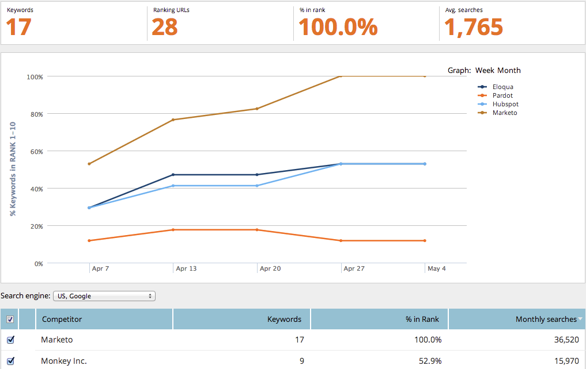

# SEO — 使用競爭者KW趨勢報表 {#seo-use-the-competitor-kw-trends-report}

在此報告中，您可以了解您和您的競爭者在一段時間內對關鍵字的排名。

## 查找報表 {#find-reports}

1. 前往 **報表**.

   

1. 按一下 **競爭性KW排名趨勢**.

   

## KW排名趨勢圖 {#kw-rank-trends-graph}

此圖表可顯示關鍵字中在指定範圍內的排名百分比，以及競爭者的堆疊方式。

| 項目 | 說明 |
|---|---|
| 關鍵字 | 您追蹤的關鍵字數。 |
| 排名URL | 您網站上的URL數，在您設定的範圍內排名。 |
| 排名% | 關鍵字排名在您設定的範圍內的百分比。 |
| 平均 搜尋 | 在您設定的範圍內(過去30天內，在Google US搜尋上)發生的這些關鍵字的平均搜尋次數 |

## 篩選資料 {#filtering-data}

1. 按一下下拉式清單，然後選取您需要的時段。

   

1. 按一下 **排名** 下拉式清單，選擇您要檢視關鍵字的排名範圍。

   

## 匯出資料  {#exporting-data}

>[!TIP]
>
>您可以將此報告匯出至案頭。

1. 按一下 **匯出CSV** 或 **Export PDF**.

   

   工作！
