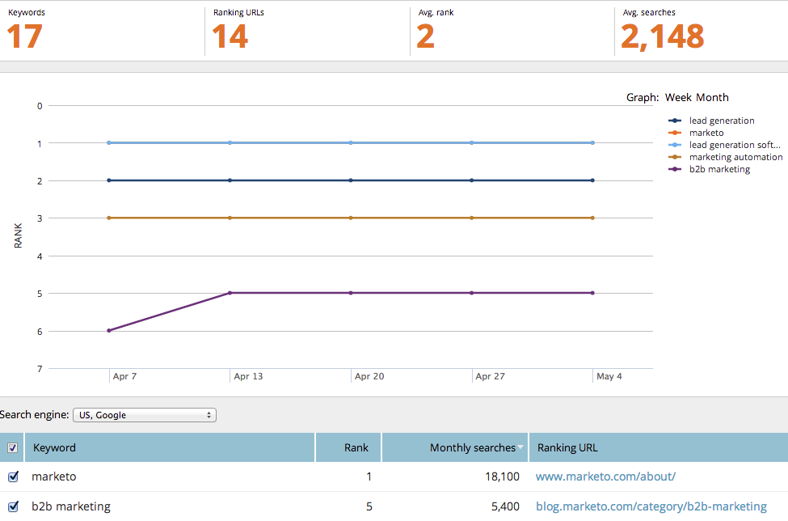

# SEO — 使用關鍵字趨勢報表 {#seo-use-the-keyword-trends-report}

在此報告中，您可了解關鍵字在一段時間內的排名方式。

## 載入報表 {#load-report}

1. 前往 **報表**.

   

1. 按一下 **關鍵字排名趨勢**.

   

   這裡：

   

   說明的報表項目：

   | 項目 | 說明 |
   |---|---|
   | 關鍵字 | 您追蹤的關鍵字數。 |
   | 排名URL | 您網站上的URL數，在您設定的範圍內排名。 |
   | 平均 排名 | 在您設定的範圍內的關鍵字平均排名。 |
   | 平均 搜尋 | 在您設定的範圍內(過去30天內，在Google美國搜尋上)發生的這些關鍵字的平均搜尋次數 |

## 篩選資料 {#filtering-data}

1. 按一下下拉式清單，然後選取您需要的時段。

   

1. 按一下「排名」下拉式清單，選擇您要檢視關鍵字的排名範圍。

   

## 匯出資料 {#exporting-data}

>[!TIP]
>
>您可以將此報告匯出至案頭。

1. 按一下「匯出CSV」或「Export PDF」。

   

   幹得好！ 您也可以在關鍵字排名中查看與競爭者的比較情形。

   >[!NOTE]
   >
   >[使用競爭KW排名趨勢報告](/help/marketo/product-docs/additional-apps/seo/reports/seo-use-the-competitor-kw-trends-report.md)
