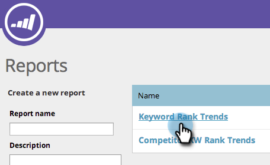

# SEO — 使用關鍵字趨勢報告 {#seo-use-the-keyword-trends-report}

在此報告中，您可以看到如何隨著時間的推移對關鍵字進行排序。

## 載入報告 {#load-report}

1. 轉到 **[!UICONTROL 報告]**。

   

1. 按一下 **[!UICONTROL 關鍵字排名趨勢]**。

   

   這裡是：

   

   描述的報表項：

   | 物料 | 說明 |
   |---|---|
   | [!UICONTROL 關鍵字] | 正在跟蹤的關鍵字數。 |
   | [!UICONTROL 排名URL] | 您所設定範圍內網站排名的URL數。 |
   | [!UICONTROL 平均 秩] | 在您設定的範圍內的關鍵字的平均等級。 |
   | [!UICONTROL 平均 搜索] | 在您設定的範圍（過去30天）中，在Google美國搜索中對這些關鍵字進行的平均搜索數 |

## 篩選資料 {#filtering-data}

1. 按一下下拉框並選擇所需的時段。

   

1. 按一下「排名」(Rank)下拉清單以選擇要查看關鍵字的排名範圍。

   

## 導出資料 {#exporting-data}

>[!TIP]
>
>您可以將此報告導出到案頭。

1. 按一下 **[!UICONTROL 導出CSV]** 或 **[!UICONTROL Export PDF]**。

   

   幹得好！ 您還可以在關鍵字排名中查看與競爭對手的比較方式。

   >[!NOTE]
   >
   >[使用競爭KW排名趨勢報告](/help/marketo/product-docs/additional-apps/seo/reports/seo-use-the-competitor-kw-trends-report.md)
