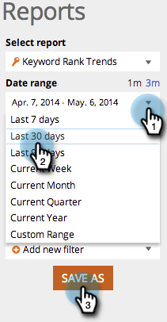

# SEO — 使用關鍵字趨勢報表 {#seo-use-the-keyword-trends-report}

在此報表中，您可以檢視一段時間內關鍵字的排名。

## 載入報告 {#load-report}

1. 前往 **[!UICONTROL 報表]**.

   

1. 按一下 **[!UICONTROL 關鍵字排名趨勢]**.

   

   內容如下：

   

   報表專案說明：

   | 專案 | 說明 |
   |---|---|
   | [!UICONTROL 關鍵字] | 您正在追蹤的關鍵字數目。 |
   | [!UICONTROL 排名URL] | 在您設定的範圍內網站排名的URL數量。 |
   | [!UICONTROL 平均 排名] | 在您設定的範圍中關鍵字的平均排名。 |
   | [!UICONTROL 平均 搜尋] | 在Google US搜尋中，這些關鍵字在您設定的範圍（過去30天）內發生的平均搜尋次數 |

## 篩選資料 {#filtering-data}

1. 按一下下拉式清單，然後選取您想要的時段。

   

1. 按一下「排名」下拉式清單，選擇要檢視關鍵字的排名範圍。

   

## 匯出資料 {#exporting-data}

>[!TIP]
>
>您可以將此報告匯出至案頭。

1. 按一下 **[!UICONTROL 匯出CSV]** 或 **[!UICONTROL Export PDF]**.

   

   做得好！您也可以在關鍵字排名中檢視與競爭對手的比較結果。

   >[!NOTE]
   >
   >[使用競爭KW排名趨勢報表](/help/marketo/product-docs/additional-apps/seo/reports/seo-use-the-competitor-kw-trends-report.md)
