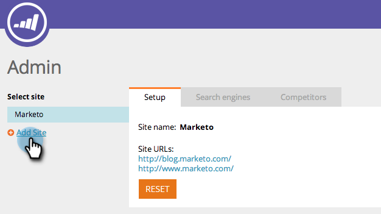

# SEO — 新增網站/刪除網站 {#seo-add-a-site-delete-a-site}

為了讓Marketo提取與您的網站頁面相關的資料（傳入連結和建議），您必須在這裡定義網站的URL。

>[!AVAILABILITY]
>
>並非所有客戶都已購買此功能。 如需詳細資訊，請聯絡您的銷售代表。

## [!UICONTROL 新增網站] {#add-a-site}

1. 按一下「管理員」下拉式清單，然後選取 **[!UICONTROL 管理員]**.

   >[!NOTE]
   >
   >**需要管理員許可權**

   

1. 按一下 **[!UICONTROL 新增網站]**.

   

1. 輸入 **[!UICONTROL 名稱]， [!UICONTROL 網站URL]** 並按一下 **[!UICONTROL 儲存]**.

   >[!TIP]
   >
   >您也可以新增 **[!UICONTROL 部落格URL]** 如果您有。

   

   太棒了！ 您剛才已新增另一個網站。

   

## 刪除網站 {#delete-a-site}

如果您追蹤多個網站，也可以刪除不再需要最佳化的網站。

1. 按一下「管理員」下拉式清單，然後選取 **[!UICONTROL 管理員]**.

   

1. 按一下您要移除的網站。

   

1. 按一下 **[!UICONTROL 刪除]**.

   

1. 確認您要 **[!UICONTROL 刪除]**.

   

   >[!NOTE]
   >
   >只有當您有多個網站時，才能刪除網站。 如果您只有一個，您可以選取場地並按一下 **[!UICONTROL 重設]**. 重設網站將 _刪除所有網站資料_ 並重新建立網站。
