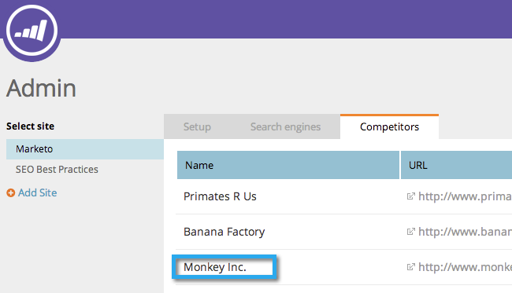

# SEO — 新增競爭者 {#seo-add-competitors}

新增競爭者可讓您針對您選擇監控的相同關鍵字和傳入連結追蹤其執行情形。

>[!NOTE]
>
>**需要管理員許可權**

1. 前往 **[!UICONTROL 管理員]** 區域。

   

1. 按一下 **[!UICONTROL 競爭者]** 標籤。

   

1. 按一下 **[!UICONTROL 新增競爭者]**.

   

1. 輸入 **[!UICONTROL 名稱]** 和 **[!UICONTROL URL]** 您競爭者的。

   

   您現在應該會在清單中看到您的競爭者。

   

   >[!MORELIKETHIS]
   >
   >* [新增關鍵字](/help/marketo/product-docs/additional-apps/seo/keywords/seo-add-keywords.md){target="_blank"}
   >* [瞭解關鍵字（競爭者檢視）](/help/marketo/product-docs/additional-apps/seo/keywords/seo-understanding-keywords.md){target="_blank"}
