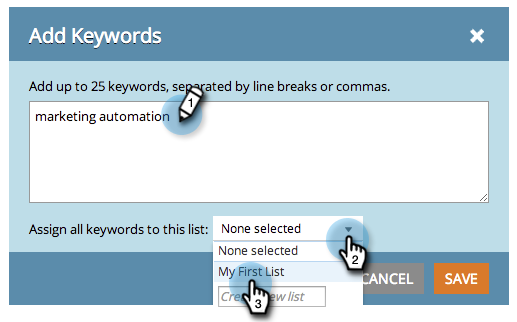

# SEO - 管理清單 {#seo-managing-lists}

新增關鍵字、頁面、頁面問題或傳入連結時，您可以將專案新增至清單。 清單可協助您保持井然有序，並可讓您篩選報表以僅檢視該清單上的資料。 以下說明如何製作範本。

>[!IMPORTANT]
>
>在2026年3月31日，Marketo Engage將淘汰搜尋引擎最佳化功能。 請在3月30日或之前匯出任何相關資料。 [了解更多](https://nation.marketo.com/t5/product-blogs/marketo-engage-seo-feature-deprecation/ba-p/359060){target="_blank"}。
>
>* [匯出問題](https://experienceleague.adobe.com/zh-hant/docs/marketo/using/product-docs/additional-apps/seo/pages/seo-export-issues-to-csv){target="_blank"}
>* [匯出關鍵字結果](https://experienceleague.adobe.com/zh-hant/docs/marketo/using/product-docs/additional-apps/seo/keywords/seo-exporting-keyword-results){target="_blank"}
>* [匯出關鍵字趨勢](https://experienceleague.adobe.com/zh-hant/docs/marketo/using/product-docs/additional-apps/seo/reports/seo-use-the-keyword-trends-report#exporting-data){target="_blank"}
>* [匯出競爭者關鍵字趨勢](https://experienceleague.adobe.com/zh-hant/docs/marketo/using/product-docs/additional-apps/seo/reports/seo-use-the-competitor-kw-trends-report#exporting-data){target="_blank"}

1. 按一下「**[!UICONTROL Add Keywords]**」。

   >[!NOTE]
   >
   >這在新增頁面、頁面問題和傳入連結時的運作方式相同。

   

1. 輸入關鍵字。 從下拉式清單中選取要新增它的清單。

   

   >[!TIP]
   >
   >您可以在下拉式清單中建立新清單。 輸入標題，按一下傳回鍵。

1. 按一下「**[!UICONTROL Save]**」。

   
