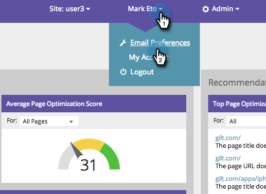

# SEO - 設定您的電子郵件提醒偏好設定 {#seo-set-your-email-alert-preferences}

您可以自訂電子郵件偏好設定，以判斷何時會更新您的SEO工作。

>[!IMPORTANT]
>
>在2026年3月31日，Marketo Engage將淘汰搜尋引擎最佳化功能。 請在3月30日或之前匯出任何相關資料。 [了解更多](https://nation.marketo.com/t5/product-blogs/marketo-engage-seo-feature-deprecation/ba-p/359060){target="_blank"}。
>
>* [匯出問題](https://experienceleague.adobe.com/en/docs/marketo/using/product-docs/additional-apps/seo/pages/seo-export-issues-to-csv){target="_blank"}
>* [匯出關鍵字結果](https://experienceleague.adobe.com/en/docs/marketo/using/product-docs/additional-apps/seo/keywords/seo-exporting-keyword-results){target="_blank"}
>* [匯出關鍵字趨勢](https://experienceleague.adobe.com/en/docs/marketo/using/product-docs/additional-apps/seo/reports/seo-use-the-keyword-trends-report#exporting-data){target="_blank"}
>* [匯出競爭者關鍵字趨勢](https://experienceleague.adobe.com/en/docs/marketo/using/product-docs/additional-apps/seo/reports/seo-use-the-competitor-kw-trends-report#exporting-data){target="_blank"}

1. 在頂端導覽列中，按一下您的使用者名稱。 按一下「**[!UICONTROL Email Preferences]**」。

   

1. 指示您想要透過電子郵件收到哪些警示，然後按一下&#x200B;**[!UICONTROL Save]**。

   
