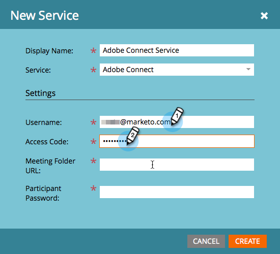

# 將Adobe Connect新增為[!DNL LaunchPoint]服務 {#add-adobe-connect-as-a-launchpoint-service}

Marketo會管理您的Adobe Connect網路研討會註冊與出席情況。

>[!NOTE]
>
>**需要管理員權限**

>[!NOTE]
>
>此步驟需要Adobe Connect的現有訂閱和管理許可權。 擁有下列設定：使用者名稱、密碼、參與者密碼和會議資料夾URL。

>[!NOTE]
>
>目前不支援Adobe Connect On Site。

1. 前往「**[!UICONTROL Admin]**」區域。

   

1. 按一下「**[!UICONTROL LaunchPoint]**」。

   

1. 按一下「**[!UICONTROL New]**」下拉式選單，選取「**[!UICONTROL New Service]**」。

   

1. 輸入&#x200B;**[!UICONTROL Display Name]**。 在&#x200B;**[!UICONTROL Service]**&#x200B;底下，選取Adobe Connect。

   

1. 輸入您的&#x200B;**[!UICONTROL Username]**&#x200B;和&#x200B;**[!UICONTROL Access Code]**。

   

1. 輸入您的&#x200B;**[!UICONTROL Meeting Folder URL]**&#x200B;和&#x200B;**[!UICONTROL Participant Password]**，然後按一下&#x200B;**[!UICONTROL Create]**&#x200B;以完成程式。

   

   >[!TIP]
   >
   >當您建立參與者密碼時，您選擇的值會在針對事件傳送連結時包含在查詢字串中。 因此，我們建議您讓它更適合客戶。

   >[!NOTE]
   >
   >登入您的Adobe Connect帳戶後，請選取「**[!UICONTROL Seminars]**」標籤。 無需深入瞭解任何特定研討會，即可將URL從瀏覽器列複製到&#x200B;**[!UICONTROL Meeting Folder URL]**&#x200B;設定。

您的Adobe Connect服務現在已與Marketo同步！

>[!MORELIKETHIS]
>
>瞭解如何[使用Adobe Connect](/help/marketo/product-docs/demand-generation/events/create-an-event/create-an-event-with-adobe-connect.md){target="_blank"}建立活動。
