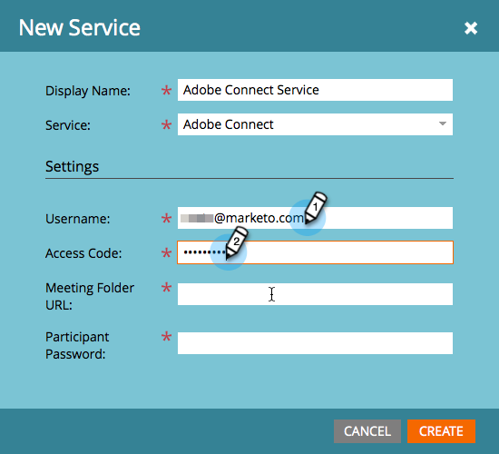

# 新增Adobe Connect as a [!DNL LaunchPoint] 服務 {#add-adobe-connect-as-a-launchpoint-service}

Marketo會管理您的Adobe Connect網路研討會註冊和出席情況。

>[!NOTE]
>
>**需要管理員許可權**

>[!NOTE]
>
>此步驟需要現有的Adobe Connect訂閱和管理許可權。 備妥下列設定：使用者名稱、密碼、參與者密碼及會議資料夾URL。

>[!NOTE]
>
>目前不支援Adobe Connect On Site。

1. 前往 **[!UICONTROL 管理員]** 區域。

   

1. 按一下 **[!UICONTROL 啟動點]**.

   

1. 按一下 **[!UICONTROL 新增]** 下拉式清單並選取 **[!UICONTROL 新服務]**.

   

1. 輸入 **[!UICONTROL 顯示名稱]**. 下 **[!UICONTROL 服務]**，選取Adobe Connect。

   

1. 輸入您的 **[!UICONTROL 使用者名稱]** 和 **[!UICONTROL 存取代碼]**.

   

1. 輸入您的 **[!UICONTROL 會議資料夾URL]** 和 **[!UICONTROL 參與者密碼]**，然後按一下 **[!UICONTROL 建立]**.

   

   >[!TIP]
   >
   >當您建立參與者密碼時，您選擇的值會在針對事件傳送連結時包含在查詢字串中。 因此，我們建議您讓此產品更符合客戶需求。

   >[!NOTE]
   >
   >登入Adobe Connect帳戶後，請選取 **[!UICONTROL 研討會]** 標籤。 您無需深入瞭解任何特定研討會，即可將URL從瀏覽器列複製到 **[!UICONTROL 會議資料夾URL]** 設定。

您的Adobe Connect服務現在已與Marketo同步！

>[!MORELIKETHIS]
>
>瞭解如何 [使用Adobe Connect建立事件](/help/marketo/product-docs/demand-generation/events/create-an-event/create-an-event-with-adobe-connect.md){target="_blank"}.
