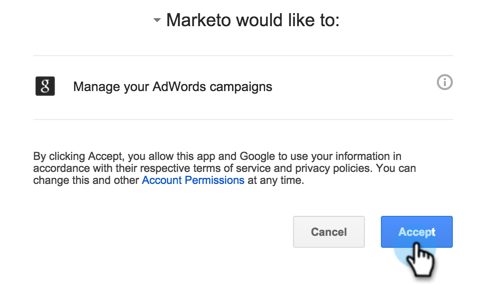

# 添加 [!DNL Google AdWords] 作為 [!DNL Launchpoint] 使用Manager帳戶提供服務 {#add-google-adwords-as-a-launchpoint-service-with-a-manager-account}

連結 [!DNL Google AdWords] 帳戶到Marketo自動將離線轉換資料從Marketo上載到 [!DNL Google AdWords]。 然後，從 [!DNL AdWords] UI，您將能夠輕鬆地看到哪些點擊在您之後產生了合格的銷售線索、銷售機會和新客戶（或您要跟蹤的任何收入階段）  [添加自定義列](https://support.google.com/adwords/answer/3073556){target="_blank"} 在 [!DNL AdWords]。 此資訊未出現在MarketoUI中。

如果你有多個 [!DNL Google Adwords] 帳戶，您可以使用 [[!DNL Google AdWords Manager Account]](https://www.google.com/adwords/manager-accounts/){target="_blank"} (前稱 [!DNL My Client Center])與Marketo整合。

瞭解有關 [Google離線轉換導入功能](https://support.google.com/adwords/answer/2998031?hl=en){target="_blank"}。

>[!AVAILABILITY]
>
>並非所有客戶都購買了此功能。 請聯繫Adobe客戶團隊（您的客戶經理）以瞭解詳細資訊。

>[!NOTE]
>
>**需要管理權限**

>[!NOTE]
>
>您還可以整合 [獨立 [!DNL Google AdWords] 帳戶 [!DNL Launchpoint] 服務](/help/marketo/product-docs/administration/additional-integrations/add-google-adwords-as-a-launchpoint-service.md){target="_blank"}。

1. 轉到 **[!UICONTROL 管理]** 的子菜單。

   

1. 選擇 **[!UICONTROL 啟動點]**。

   

1. 按一下 **[!UICONTROL 新建]** 下拉並選擇 **[!UICONTROL 新服務]**。

   

1. 輸入 **[!UICONTROL 顯示名稱]** 選擇 **[!UICONTROL Google廣告詞]**。

   

1. 選擇 **[!UICONTROL 授權Marketo]**。

   >[!NOTE]
   >
   >確保註銷您的個人 [!DNL Gmail] 帳戶並啟用彈出窗口。

   

1. 選擇與關聯的帳戶 **[!DNL Google AdWords]**。

   

1. 按一下 **[!UICONTROL 接受]**。

   

1. 狀態將顯示為 **[!UICONTROL 成功]**。 選擇 **[!UICONTROL 下一個]**。

   

1. 將離線轉換從Marketo上傳到 [!DNL Google AdWords] **[!UICONTROL 每週]** 或 **[!UICONTROL 每日]**。

   

1. 屬性轉換到 **[!UICONTROL 首次按一下]** 或 **[!UICONTROL 上次按一下]**。

   

   | 類型 | 定義 |
   |---|---|
   | [!UICONTROL 首次按一下] | 離線轉換將歸屬於第一個 [!DNL AdWords] 一個人在過去90天裡 |
   | [!UICONTROL 上次按一下] | 離線轉換將歸屬於最後一個 [!DNL AdWords] 一個人點擊 |

   >[!NOTE]
   >
   >[自動標籤](https://support.google.com/adwords/answer/1752125?hl=en){target="_blank"} 必須選擇此功能才能正常工作。 必須在內部激活 [!DNL AdWords]。

1. 按一下 **[!UICONTROL 下一個]**。

   

1. 取消選擇不想更新的帳戶。 按一下 **[!UICONTROL 建立]**。

   

   現在，請參閱下面的相關文章以瞭解如何映射 [!DNL AdWords] 收入模型中的離線轉換。

   >[!MORELIKETHIS]
   >
   >[設定 [!DNL Google AdWords] 使用Manager帳戶在收入模型中的轉換](/help/marketo/product-docs/reporting/revenue-cycle-analytics/revenue-cycle-models/set-google-adwords-conversions-in-the-revenue-model-with-a-manager-account.md){target="_blank"}
