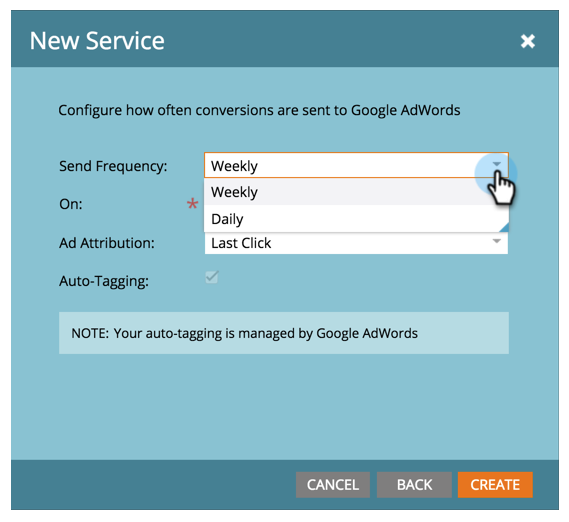

# 新增 [!DNL Google AdWords] as a [!DNL LaunchPoint] 服務 {#add-google-adwords-as-a-launchpoint-service}

連結您的 [!DNL Google AdWords] 帳戶至Marketo以自動從Marketo上傳離線轉換資料至 [!DNL Google AdWords]. 然後，從 [!DNL AdWords] UI，您將可輕鬆檢視哪些點按導致符合條件的銷售機會、商機和新客戶（或您要追蹤的任何收入階段） [新增自訂欄](https://support.google.com/adwords/answer/3073556){target="_blank"} 在 [!DNL AdWords]. 此資訊不會出現在Marketo UI中。

進一步瞭解 [Google的離線轉換匯入功能](https://support.google.com/adwords/answer/2998031?hl=en){target="_blank"}.

>[!AVAILABILITY]
>
>並非所有客戶都已購買此功能。 如需詳細資訊，請聯絡Adobe客戶團隊（您的客戶經理）。

>[!NOTE]
>
>**需要管理員許可權**

>[!NOTE]
>
>您也可以整合 [[!DNL Google AdWords] as a [!DNL Launchpoint] 以經理帳戶提供服務](/help/marketo/product-docs/administration/additional-integrations/add-google-adwords-as-a-launchpoint-service-with-a-manager-account.md){target="_blank"}.

1. 前往 **[!UICONTROL 管理員]** 區域。

   

1. 選取 **[!UICONTROL 啟動點]**.

   

1. 選取 **[!UICONTROL 新增]** 和 **[!UICONTROL 新服務]**.

   

1. 輸入 [!UICONTROL 顯示名稱] 並選取 **[!UICONTROL Google AdWords]**.

   

1. 選取 **[!UICONTROL 授權Marketo]**.

   >[!NOTE]
   >
   >請務必登出您的個人檔案 [!DNL Gmail] 帳戶並啟用快顯視窗。

   

1. 選取您與關聯的帳戶 [!DNL Google AdWords].

   

1. 選取 **[!UICONTROL Accept]**.

   

1. 狀態將顯示為 **[!UICONTROL 成功]**. 選取 **[!UICONTROL 下一個]**.

   

1. 將離線轉換從Marketo上傳至 [!DNL Google AdWords] **[!UICONTROL 每週]** 或 **[!UICONTROL 每日]**.

   

1. 將屬性轉換至 **[!UICONTROL 首次點按]** 或 **[!UICONTROL 最後點按]**.

   

   | 類型 | 定義 |
   |---|---|
   | [!UICONTROL 首次點按] | 離線轉換將歸因於 [!DNL AdWords] 個人在過去90天內點選的廣告 |
   | [!UICONTROL 最後點按] | 離線轉換將歸因到最後一個 [!DNL AdWords] 某人點選的廣告 |

   >[!NOTE]
   >
   >在Marketo中使用一致的歸因模型和 [!DNL AdWords] 提供最準確的資料。

1. 按一下 **[!UICONTROL 建立]**。

   

   >[!NOTE]
   >
   >[自動標籤](https://support.google.com/adwords/answer/1752125?hl=en){target="_blank"} 必須選取才能使用此功能。 停用必須在內完成 [!DNL AdWords].

太棒了！ 現在請參閱下文相關文章，瞭解如何對應 [!DNL AdWords] 您的收入模型中的離線轉換。

>[!MORELIKETHIS]
>
>[設定 [!DNL Google AdWords] 收入模型中的轉換](/help/marketo/product-docs/reporting/revenue-cycle-analytics/revenue-cycle-models/set-google-adwords-conversions-in-the-revenue-model.md){target="_blank"}
