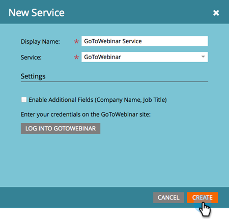

# 將[!DNL GoToWebinar]新增為[!DNL LaunchPoint]服務 {#add-gotowebinar-as-a-launchpoint-service}

Marketo會管理您的[!DNL GoToWebinar]註冊和出席情況。

>[!NOTE]
>
>**需要管理員權限**

>[!NOTE]
>
>此步驟需要[!DNL GoToWebinar]的現有訂閱和管理許可權。 取得您用來登入[!DNL GoToWebinar]的電子郵件和密碼。

>[!NOTE]
>
>目前不支援[!DNL GoToMeeting]、[!DNL GoToWebcast]和[!DNL GoToTraining]。

1. 前往「**[!UICONTROL Admin]**」區域。

   

1. 按一下「**[!UICONTROL LaunchPoint]**」。

   

1. 選取&#x200B;**[!UICONTROL New]**&#x200B;和&#x200B;**[!UICONTROL New Service]**。

   

1. 輸入&#x200B;**[!UICONTROL Display Name]**。 在&#x200B;**[!UICONTROL Service]**&#x200B;下，選取&#x200B;**[!UICONTROL GoToWebinar]**。

   

1. 按一下「**[!UICONTROL Log Into GoToWebinar]**」。

   

   >[!NOTE]
   >
   >如果您想要將Marketo表單中的公司名稱與職稱同步至[!DNL GoToWebinar]，請選取「**[!UICONTROL Enable Additional Fields]**」方塊。

1. 在「[!DNL GoToWebinar]登入」彈出式視窗中，輸入您的&#x200B;**[!UICONTROL GoToWebinar]**&#x200B;電子郵件和密碼，然後按一下「**[!UICONTROL Sign In]**」。

   

1. 視窗關閉後，按一下&#x200B;**[!UICONTROL Create]**。

   

1. 太棒了！ 您的&#x200B;**[!UICONTROL GoToWebinar]**&#x200B;帳戶現在已與Marketo同步。

   

>[!CAUTION]
>
>當您在[!DNL GoToWebinar]中更新密碼時，也必須在Marketo中更新密碼。

>[!MORELIKETHIS]
>
>瞭解如何[使用 [!DNL GotoWebinar]](/help/marketo/product-docs/demand-generation/events/create-an-event/create-an-event-with-gotowebinar.md){target="_blank"}建立事件。
