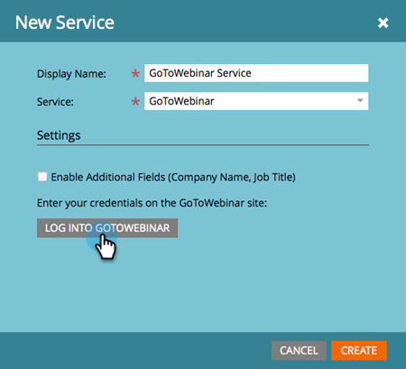

# 新增 [!DNL GoToWebinar] as a [!DNL LaunchPoint] 服務 {#add-gotowebinar-as-a-launchpoint-service}

Marketo管理您的 [!DNL GoToWebinar] 報名及出席。

>[!NOTE]
>
>**需要管理員許可權**

>[!NOTE]
>
>的現有訂閱 [!DNL GoToWebinar] 此步驟需要與管理許可權。 擁有您用來登入的電子郵件和密碼 [!DNL GoToWebinar] 手邊。

>[!NOTE]
>
>[!DNL GoToMeeting]， [!DNL GoToWebcast]、和 [!DNL GoToTraining] 目前不支援。

1. 前往 **[!UICONTROL 管理員]** 區域。

   

1. 按一下 **[!UICONTROL 啟動點]**.

   

1. 選取 **[!UICONTROL 新增]** 和 **[!UICONTROL 新服務]**.

   

1. 輸入 **[!UICONTROL 顯示名稱]**. 在 **[!UICONTROL 服務]**，選取 **[!UICONTROL GoToWebinar]**.

   

1. 按一下 **[!UICONTROL 登入GoTo網路研討會]**.

   

   >[!NOTE]
   >
   >如果您想要將Marketo表單中的公司名稱和職稱同步至 [!DNL GoToWebinar]，選取 **[!UICONTROL 啟用其他欄位]** 方塊。

1. 在 [!DNL GoToWebinar] 登入快顯視窗，輸入您的 **[!UICONTROL GoToWebinar]** 電子郵件和密碼，然後按一下 **[!UICONTROL 登入]**.

   

1. 視窗關閉後，按一下 **[!UICONTROL 建立]**.

   

1. 太棒了！ 您的 **[!UICONTROL GoToWebinar]** 帳戶現在已與Marketo同步。

   

>[!CAUTION]
>
>當您在中更新密碼時 [!DNL GoToWebinar]，您也必須在Marketo中更新密碼。

>[!MORELIKETHIS]
>
>瞭解如何 [建立事件，使用 [!DNL GotoWebinar]](/help/marketo/product-docs/demand-generation/events/create-an-event/create-an-event-with-gotowebinar.md){target="_blank"}.
