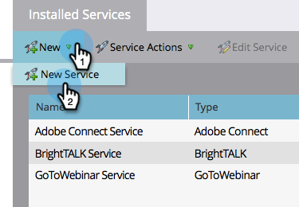

# 新增 [!DNL Level 3 Web Meeting] as a [!DNL LaunchPoint] 服務 {#add-level-three-web-meeting-as-a-launchpoint-service}

Marketo管理您的 [!DNL Level 3 Web Meeting] 報名及出席。

>[!NOTE]
>
>**需要管理員許可權**

>[!NOTE]
>
>的現有訂閱 [!DNL Level 3 Web Meeting] 此步驟需要與管理許可權。 準備好您的存取號碼、存取碼和密碼。

1. 前往 **[!UICONTROL 管理員]** 區域。

   

1. 按一下 **[!UICONTROL 啟動點]**.

   

1. 選取 **[!UICONTROL 新增]** 然後 **[!UICONTROL 新服務]**.

   

1. 輸入 **[!UICONTROL 顯示名稱]**. 在 **[!UICONTROL 服務]**，選取 **[!UICONTROL 第3級Web會議]**.

   

1. 輸入您的 **[!UICONTROL 存取號碼]**， **[!UICONTROL 存取代碼]**、和 **[!UICONTROL 密碼]**，然後按一下 **[!UICONTROL 建立]**.

   

您的 [!DNL Level 3 Web Meeting] 帳戶現在已與Marketo同步！

>[!MORELIKETHIS]
>
>瞭解如何 [使用建立事件 [!DNL Level 3 Web Meeting]](/help/marketo/product-docs/demand-generation/events/create-an-event/create-an-event-with-level-3-web-meeting.md){target="_blank"}.
