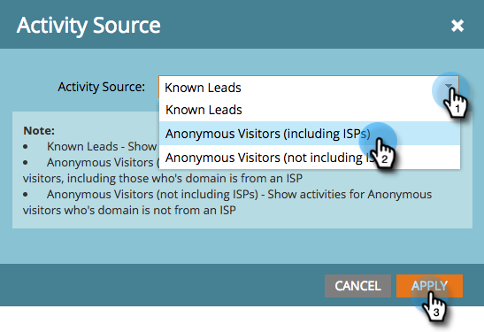

# 將Munchkin追蹤程式碼新增至您的網站 {#add-munchkin-tracking-code-to-your-website}

Marketo的自訂JavaScript追蹤程式碼（稱為Munchkin）會追蹤所有造訪您網站的個人，讓您透過自動化行銷活動回應其造訪。 即使是匿名訪客，也會隨其IP位址和其他資訊受到追蹤。 **若沒有此追蹤代碼，您將無法追蹤網站上的造訪或其他活動**!

>[!PREREQUISITES]
>
>請確定您擁有經驗豐富的JavaScript開發人員的存取權。 Marketo技術支援未設定來協助疑難排解自訂JavaScript。

## 新增追蹤代碼至您的網站 {#add-tracking-code-to-your-website}

>[!NOTE]
>
>Adobe Experience Cloud客戶也可以在AdobeLaunch中使用Marketo的整合，在其網頁上加入Munchkin指令碼。 取得應用程式 [此處](https://www.adobeexchange.com/experiencecloud.details.101054.html).

1. 前往 **管理** 的上界。

   

1. 按一下 **蒙奇金**.

   

1. 選取非同步以追蹤程式碼類型。

   

   >[!NOTE]
   >
   >在幾乎所有情況下，您都應使用非同步程式碼。 [了解更多](#types-of-munchkin-tracking-codes).

1. 按一下並複製Javascript追蹤程式碼以放置在您的網站上。

   

   >[!CAUTION]
   >
   >請勿使用此螢幕擷取中顯示的程式碼 — 您必須使用顯示在帳戶中的唯一程式碼！

   >[!TIP]
   >
   >將追蹤程式碼放在您要追蹤的網頁上。 這可能是小型網站的每個頁面，或只是網站上有許多動態產生的網頁、使用者論壇等重要頁面。

   為獲得最佳結果，請使用非同步Munchkin程式碼，並將其放入 `<head>` 頁面的元素。 如果您使用簡單程式碼（不建議使用），則會緊接在 `</body>` 標籤。

   

   >[!TIP]
   >
   >若網站出現大量流量（即每月數十萬次瀏覽），建議您選擇不追蹤匿名訪客。 [了解更多](https://developers.marketo.com/documentation/websites/lead-tracking-munchkin-js/).

## 使用多個工作區時新增追蹤代碼 {#add-tracking-code-when-using-multiple-workspaces}

如果您在Marketo帳戶中使用工作區，則您可能也有對應至您工作區的個別Web存在。 在這種情況下，您可以使用Munchkin追蹤Javascript，將匿名人員指派至正確的工作區和分區。

1. 前往 **管理** 的上界。

   

1. 按一下 **蒙奇金**.

   

1. 為您要追蹤的網頁選取適當的工作區。

   

   >[!NOTE]
   >
   >如果您不使用特殊的工作區Munchkin代碼，則會將人員分配給在帳戶設定時建立的預設分區。 起初它命名為「預設」，但您可能已在自己的Marketo帳戶中變更該名稱。

1. 選擇 **非同步** ，以追蹤代碼類型。

   

1. 按一下並複製JavaScript追蹤程式碼以放置在您的網站上。

   

   >[!CAUTION]
   >
   >請勿使用此螢幕擷取中顯示的程式碼 — 您必須使用顯示在帳戶中的唯一程式碼！

1. 將追蹤程式碼放置在 `<head>` 元素。 將為此分區分配訪問此頁的新人員。

   

   >[!CAUTION]
   >
   >對於頁面上的單一分區和工作區，只能使用一個Munchkin追蹤指令碼。 請勿在網站上包含多個分區/工作區的追蹤指令碼。

   >[!NOTE]
   >
   >在Marketo中建立的登錄頁面會自動包含追蹤程式碼，因此您不需要將此程式碼放在這些程式碼上。

## Munchkin追蹤程式碼類型 {#types-of-munchkin-tracking-codes}

您可以選擇三種類型的Munchkin追蹤代碼。 每個網頁載入時間的影響都不同。

1. **簡單**:程式碼行最少，但無法針對網頁載入時間進行最佳化。 此程式碼會在每次載入網頁時載入jQuery程式庫。
1. **非同步**:減少網頁載入時間。
1. **非同步jQuery**:減少網頁載入時間，提高系統效能。 此程式碼假設您已擁有jQuery，且不會檢查以載入。

## 測試您的Munchkin程式碼是否正常運作 {#test-if-your-munchkin-code-is-working}

若要在新增Munchkin程式碼後確認其有效運作：

1. 造訪您的網頁。

1. 在您的「我的Marketo」中，按一下 **Analytics** 方塊。

   

1. 按一下 **網頁活動**.

   

1. 按一下 **設定** 按兩下 **活動來源**.

   

1. 將活動來源變更為 **匿名訪客（包括ISP）** 按一下 **套用**.

   

1. 按一下 **報表** 標籤。

   

   >[!NOTE]
   >
   >如果您沒有看到任何資料，請等候幾分鐘，然後按一下底部的重新整理圖示。
