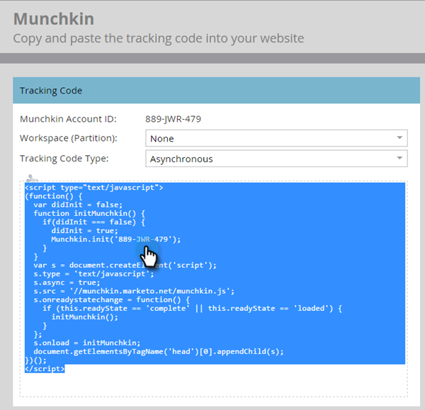
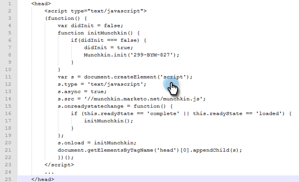
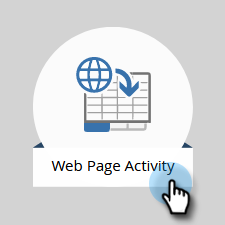

# 新增[!DNL Munchkin]追蹤程式碼至您的網站 {#add-munchkin-tracking-code-to-your-website}

Marketo的自訂JavaScript追蹤程式碼([!DNL Munchkin])會追蹤造訪您網站的所有個人，讓您能夠透過自動化行銷活動來回應他們的造訪。 系統甚至會追蹤匿名訪客及其IP位址和其他資訊。 **若沒有此追蹤程式碼，您將無法追蹤您網站的造訪或其他活動**！

>[!PREREQUISITES]
>
>確保您可以存取經驗豐富的JavaScript開發人員。 Marketo技術支援未設定為協助疑難排解自訂JavaScript。

## 將追蹤代碼新增至您的網站 {#add-tracking-code-to-your-website}

>[!NOTE]
>
>Adobe Experience Cloud使用者也可以在Adobe Launch[&#128279;](https://exchange.adobe.com/apps/ec/100223/adobe-launch-core-extension){target="_blank"}中使用Marketo整合，以在其網頁上包含[!DNL Munchkin]指令碼。 如果您使用Adobe Launch，_會自動新增[!DNL Munchkin]指令碼_，因此您不需要自行新增。

1. 前往「**[!UICONTROL Admin]**」區域。

   

1. 按一下「**[!UICONTROL Munchkin]**」。

   

1. 為&#x200B;**[!UICONTROL Tracking Code Type]**&#x200B;選取&#x200B;**[!UICONTROL Asynchronous]**。

   

   >[!NOTE]
   >
   >在幾乎所有情況下，您都應該使用非同步程式碼。 [了解更多](#types-of-munchkin-tracking-codes)。

1. 複製JavaScript追蹤程式碼以新增至您的網站。

   

   >[!CAUTION]
   >
   >請勿使用此熒幕擷圖中所示的代碼，您必須使用帳戶中顯示的唯一代碼。

   >[!TIP]
   >
   >在您要追蹤的網頁上放置追蹤程式碼。 這可能是小型網站的每個頁面，或只有具有許多動態產生的網頁、使用者論壇等網站的重點頁面。

   為了獲得最佳結果，請使用非同步[!DNL Munchkin]程式碼並將其放置在頁面的`<head>`元素中。 如果您使用簡單程式碼（不建議使用），這會在`</body>`標籤之前。

   

   >[!TIP]
   >
   >若是看到大量流量的網站（即每月有數十萬次造訪），建議您不要追蹤匿名人員。 [了解更多](https://experienceleague.adobe.com/zh-hant/docs/marketo-developer/marketo/javascriptapi/leadtracking/lead-tracking){target="_blank"}。

## 使用多個工作區時新增追蹤程式碼 {#add-tracking-code-when-using-multiple-workspaces}

如果您在Marketo帳戶中使用Workspaces，則您可能也會有與您的Workspaces對應的個別Web存在。 在這種情況下，您可以使用[!DNL Munchkin]追蹤Javascript將匿名人員指派至正確的工作區和磁碟分割。

1. 前往「**[!UICONTROL Admin]**」區域。

   

1. 按一下「**[!UICONTROL Munchkin]**」。

   

1. 選取您要追蹤之網頁的適當工作區。

   

   >[!NOTE]
   >
   >如果您不使用特殊工作區[!DNL Munchkin]程式碼，則會將人員指派給設定帳戶時所建立的預設分割區。 預設名稱為&#39;[!UICONTROL Default]&#39;，但此名稱可能已變更。

1. 為&#x200B;**[!UICONTROL Tracking Code Type]**&#x200B;選取&#x200B;**[!UICONTROL Asynchronous]**。

   

1. 複製JavaScript追蹤程式碼以新增至您的網站。

   

   >[!CAUTION]
   >
   >請勿使用此熒幕擷圖中所示的代碼，您必須使用帳戶中顯示的唯一代碼。

1. 將追蹤程式碼放置在網頁的`<head>`元素中。 造訪此頁面的新人員會指派給此分割區。

   

   >[!CAUTION]
   >
   >您只能對頁面上的單一資料分割和工作區使用一個[!DNL Munchkin]追蹤指令碼。 請勿在網站上包含多個分割區/工作區的追蹤指令碼。

   >[!NOTE]
   >
   >在Marketo中建立的登入頁面會自動包含追蹤代碼。 您不需要將此程式碼新增到其中。

## [!DNL Munchkin]追蹤程式碼的型別 {#types-of-munchkin-tracking-codes}

有三種型別的[!DNL Munchkin]追蹤程式碼可供您選擇。 每個專案對網頁載入時間的影響都不同。

1. **[!UICONTROL Simple]**：具有最少的程式碼行，但無法最佳化網頁載入時間。 此程式碼會在每次載入網頁時載入jQuery程式庫。
1. **[!UICONTROL Asynchronous]**：減少網頁載入時間。
1. **[!UICONTROL Asynchronous jQuery]**：減少網頁載入時間，同時改善系統效能。 此程式碼假設您已擁有jQuery，且未檢查以載入它。

## 測試您的[!DNL Munchkin]程式碼是否正常運作 {#test-if-your-munchkin-code-is-working}

若要檢查您的[!DNL Munchkin]程式碼在新增後是否正常運作：

1. 造訪您的網頁。

1. 在您的[!DNL My Marketo]中，按一下&#x200B;**[!UICONTROL Analytics]**&#x200B;圖磚。

   

1. 按一下「**[!UICONTROL Web Page Activity]**」。

   

1. 按一下「**[!UICONTROL Setup]**」標籤，連按兩下「**[!UICONTROL Activity Source]**」。

   

1. 將[!UICONTROL Activity Source]變更為&#x200B;**[!UICONTROL Anonymous Visitors (including ISPs)]**&#x200B;並按一下&#x200B;**[!UICONTROL Apply]**。

   

1. 按一下「**[!UICONTROL Report]**」索引標籤。

   

   >[!NOTE]
   >
   >如果您沒有看到任何資料，請稍候幾分鐘，然後按一下底部的[!UICONTROL refresh]圖示。
