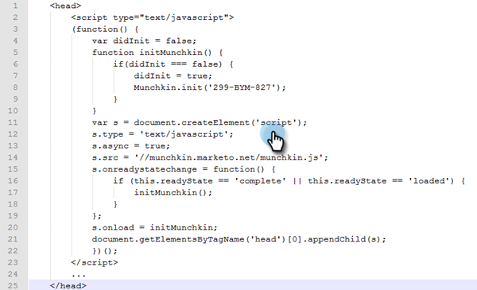

# 新增 [!DNL Munchkin] 追蹤程式碼至您的網站 {#add-munchkin-tracking-code-to-your-website}

Marketo的自訂JavaScript追蹤程式碼，稱為 [!DNL Munchkin]，會追蹤造訪您網站的所有個人，這樣您就能透過自動化行銷活動對其造訪做出反應。 系統甚至會追蹤匿名訪客及其IP位址和其他資訊。 **若沒有此追蹤代碼，您將無法追蹤網站上的造訪或其他活動**！

>[!PREREQUISITES]
>
>請確定您有權存取經驗豐富的JavaScript開發人員。 Marketo技術支援未設定為協助疑難排解自訂JavaScript。

## 新增追蹤程式碼至您的網站 {#add-tracking-code-to-your-website}

>[!NOTE]
>
>Adobe Experience Cloud客戶也可以在Adobe Launch中使用Marketo的整合來包含 [!DNL Munchkin] 指令碼在他們的網頁上。 取得應用程式 [此處](https://www.adobeexchange.com/experiencecloud.details.101054.html){target="_blank"}.

1. 前往 **[!UICONTROL 管理員]** 區域。

   

1. 按一下 **[!UICONTROL Munchkin]**.

   

1. 選取 **[!UICONTROL 非同步]** 的 **[!UICONTROL 追蹤程式碼型別]**.

   

   >[!NOTE]
   >
   >在幾乎所有情況下，您都應該使用非同步程式碼。 [深入了解](#types-of-munchkin-tracking-codes).

1. 按一下並複製Javascript追蹤程式碼，以放在您的網站上。

   

   >[!CAUTION]
   >
   >請勿使用此熒幕擷圖中所示的代碼，您必須使用帳戶中顯示的唯一代碼！

   >[!TIP]
   >
   >將追蹤程式碼放在您要追蹤的網頁上。 這可能是小型網站的每個頁面，或只有擁有許多動態產生網頁、使用者論壇等之網站上的關鍵頁面。

   為獲得最佳結果，請使用非同步 [!DNL Munchkin] 程式碼並放入 `<head>` 元素進行修改。 如果您使用簡單程式碼（不建議使用），則它緊接在 `</body>` 標籤之間。

   

   >[!TIP]
   >
   >若是網站發生大量流量（亦即每月有數十萬次造訪），建議您不要追蹤匿名訪客。 [深入了解](https://developers.marketo.com/documentation/websites/lead-tracking-munchkin-js/).

## 使用多個工作區時新增追蹤程式碼 {#add-tracking-code-when-using-multiple-workspaces}

如果您在Marketo帳戶中使用工作區，則可能也有與工作區對應的個別Web存在。 在此情況下，您可以使用 [!DNL Munchkin] 追蹤Javascript以將匿名人員指派至正確的工作區和磁碟分割。

1. 前往 **[!UICONTROL 管理員]** 區域。

   

1. 按一下 **[!UICONTROL Munchkin]**.

   

1. 選取您要追蹤之網頁的適當工作區。

   

   >[!NOTE]
   >
   >如果您不使用特殊工作區 [!DNL Munchkin] 程式碼，會將人員指派給設定帳戶時建立的預設磁碟分割。 它名為「[!UICONTROL 預設]&quot;一開始，但您可能會在自己的帳戶Marketo中變更此設定。

1. 選取 **[!UICONTROL 非同步]** 的 **[!UICONTROL 追蹤程式碼型別]**.

   

1. 按一下並複製JavaScript追蹤程式碼，以放在您的網站上。

   

   >[!CAUTION]
   >
   >請勿使用此熒幕擷圖中所示的代碼，您必須使用帳戶中顯示的唯一代碼！

1. 將追蹤程式碼放置在下列位置中的網頁： `<head>` 元素。 造訪此頁面的新使用者將被指派到此磁碟分割。

   

   >[!CAUTION]
   >
   >您只能使用一個 [!DNL Munchkin] 頁面上單一分割區和工作區的追蹤指令碼。 請勿在您的網站上包含多個分割區/工作區的追蹤指令碼。

   >[!NOTE]
   >
   >在Marketo中建立的登入頁面會自動包含追蹤程式碼，因此您不需要將此程式碼放在這些頁面上。

## 型別 [!DNL Munchkin] 追蹤程式碼 {#types-of-munchkin-tracking-codes}

有三種型別 [!DNL Munchkin] 您可以選擇的追蹤程式碼。 每個事件對網頁載入時間的影響都不同。

1. **[!UICONTROL 簡單]**：程式碼行數最少，但不會針對網頁載入時間進行最佳化。 每次載入網頁時，此程式碼都會載入jQuery程式庫。
1. **[!UICONTROL 非同步]**：減少網頁載入時間。
1. **[!UICONTROL 非同步jQuery]**：減少網頁載入時間並改善系統效能。 此程式碼假設您已擁有jQuery，且未檢查以載入它。

## 測試您的 [!DNL Munchkin] 程式碼運作中 {#test-if-your-munchkin-code-is-working}

若要檢查您的 [!DNL Munchkin] 程式碼在新增後仍可運作：

1. 造訪您的網頁。

1. 在您的 [!DNL My Marketo]，按一下 **[!UICONTROL 分析]** 圖磚。

   

1. 按一下 **[!UICONTROL 網頁活動]**.

   

1. 按一下 **[!UICONTROL 設定]** 標籤，按兩下 **[!UICONTROL 活動來源]**.

   

1. 變更 [!UICONTROL 活動來源] 至 **[!UICONTROL 匿名訪客（包括ISP）]** 並按一下 **[!UICONTROL 套用]**.

   

1. 按一下 **[!UICONTROL 報告]** 標籤。

   

   >[!NOTE]
   >
   >如果您沒有看到任何資料，請等待幾分鐘，然後按一下底部的重新整理圖示。
