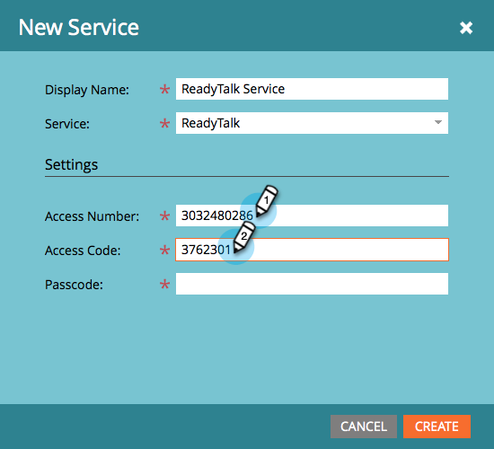
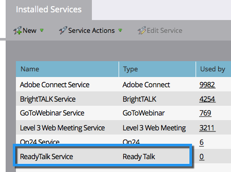

# 將ReadyTalk添加為LaunchPoint服務 {#add-readytalk-as-a-launchpoint-service}

Marketo負責管理您的ReadyTalk網路研討會註冊和出席情況。

>[!NOTE]
>
>**需要管理權限**

>[!NOTE]
>
>此步驟需要對ReadyTalk和管理權限的現有訂閱。 現有下列設定：訪問號、訪問代碼和密碼。

1. 前往 **管理** 的上界。

   

1. 按一下 **LaunchPoint**.

   

1. 選擇 **新增** 然後 **新服務**.

   

1. 輸入 **顯示名稱**. 在 **服務**，選取 **ReadyTalk**.

   

1. 輸入 **訪問次數** 和 **存取代碼**.

   

1. 輸入 **密碼** 按一下 **建立**.

   

您的 **ReadyTalk** 帳戶現在已與Marketo同步。

>[!MORELIKETHIS]
>
>了解如何 [使用ReadyTalk建立事件](/help/marketo/product-docs/demand-generation/events/create-an-event/create-an-event-with-readytalk.md).
