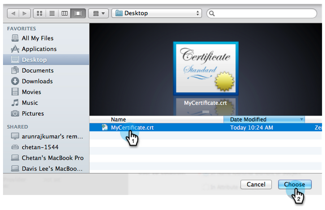

# 將單一登入新增至入口網站{#add-single-sign-on-to-a-portal}

如果您有驗證使用者的目錄服務，則可允許單一登入(SSO)進入Marketo。 我們使用2.0版及更高版本的安全性斷言標籤語言(SAML)支援此功能。

Marketo以SAML服務提供者(SP)的身分運作，並依賴外部身分提供者(IdP)來驗證使用者。

啟用SSO後，IdP即可驗證使用者的認證。 當使用者想要使用Marketo軟體時，IdP會傳送簽署的SAML訊息給Marketo，做為SP。 這則訊息為Marketo提供保險箱，讓使用者有權使用Marketo軟體。

>[!NOTE]
>
>**需要管理員權限**

>[!NOTE]
>
>您是Microsoft Azure使用者嗎？ 查看他們的[整合教學課程](https://azure.microsoft.com/en-us/documentation/articles/active-directory-saas-marketo-tutorial/)。

## 如何傳送請求{#how-to-send-the-request}

* 將SSO請求（即SAML回應）傳送至`https://login.marketo.com/saml/assertion/<your-munchkin-id>`
* 作為SP的對象URL。 使用`https://saml.marketo.com/sp`
* 如果使用SPNameQualifier屬性，請將「主體」的NameID元素設定為`https://saml.marketo.com/sp`
* 如果要將多個Marketo訂閱聯合到同一SSO提供程式，則可以對格式為`https://saml.marketo.com/sp/<munchkin_id>`的每個Marketo子使用唯一的SP URL

>[!NOTE]
>
>Marketo僅支援由身分提供者啟動（又稱為IdP啟動），使用者先啟動Idp登入頁面、驗證後導覽至我的Marketo。

## 其他附註{#additional-notes}

* **同步時間** -對於新使用者，在處理初始SSO要求之前大約有10分鐘的延遲。
* **用戶設定** -由Marketo手動設定用戶。
* **授權** -使用者權限在Marketo境內維持。
* **OAuth支援** -Marketo目前不支援OAuth。
* **自動使用者傳播** -也稱為「及時布建」，這是當使用者的第一次SAML登入能夠在其存取的任何Web應用程式中建立使用者(例如，Marketo)，而不需要手動管理動作時。Marketo目前不支援這一點。
* **加密** -Marketo目前不支援加密。

>[!NOTE]
>
>在開始之前，請以X.509格式及。crt、.der或。cer副檔名提供您的身分提供者憑證。

## 更新SAML設定{#update-saml-settings}

SSO預設為停用。 請依照下列步驟啟用SAML並加以設定。

1. 前往&#x200B;**Admin**，然後按一下「單一登入」**。**

   

   >[!NOTE]
   >
   >如果您在&#x200B;**Admin**&#x200B;下未看到&#x200B;**單一登入**，請聯絡[Marketo支援](https://nation.marketo.com/t5/Support/ct-p/Support)。

1. 在「**SAML設定**」區段下，按一下「編輯&#x200B;**」。**

   

1. 將&#x200B;**SAML單一登入**&#x200B;變更為&#x200B;**Enabled**。

   

1. 輸入&#x200B;**發行商ID**、**實體ID**，選擇&#x200B;**使用者ID位置**，然後按一下&#x200B;**瀏覽**。

   

1. 選擇您的&#x200B;**身分提供者憑證**&#x200B;檔案。

   

1. 按一下&#x200B;**保存**。

   

## 更新重新導向頁面設定{#update-redirect-page-settings}

1. 在&#x200B;**重新導向頁面**&#x200B;區段下，按一下&#x200B;**編輯**。

   

   >[!NOTE]
   >
   >使用通用ID及SSO的客戶必須在&#x200B;**登入URL**&#x200B;欄位中輸入身分提供者的登入URL。

1. 輸入&#x200B;**註銷URL**。 這是當使用者登出Marketo時，您要將其導向至的URL。

   

1. 輸入&#x200B;**錯誤URL**。 這是您希望使用者在登入Marketo失敗時被導向的URL。 按一下&#x200B;**保存**。

   

   >[!NOTE]
   >
   >這兩個頁面都必須公開提供。

>[!MORELIKETHIS]
>
>* [使用通用ID進行訂閱登入](/help/marketo/product-docs/administration/settings/using-a-universal-id-for-subscription-login.md)
>* [僅限使用者登入SSO](/help/marketo/product-docs/administration/additional-integrations/restrict-user-login-to-sso-only.md)
>* [邀請Marketo用戶使用兩個具有通用ID的實例](https://nation.marketo.com/t5/Knowledgebase/Inviting-Marketo-Users-to-Two-Instances-with-Universal-ID-UID/ta-p/251122)

