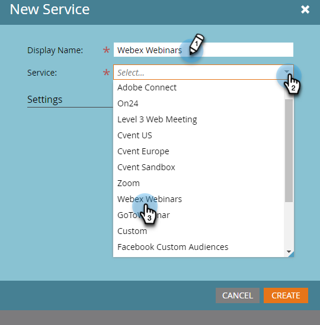

# 新增 [!DNL Webex] as a [!DNL LaunchPoint] 服務 {#add-webex-as-a-launchpoint-service}

Marketo Engage管理您的 [!DNL Webex] 網路研討會報名與出席。

>[!NOTE]
>
>**需要管理員許可權**

>[!NOTE]
>
>的現有訂閱 [!DNL Webex] 此步驟需要和管理許可權。 準備好下列設定：使用者名稱、密碼和網站名稱。

>[!NOTE]
>
>網站名稱可在用來登入的URL結尾找到 [!DNL Webex]. 例如：
>
>`https://mycompany.webex.com/mw0300lc/mywebex/default.do?siteurl=mycompany`
>
>**注意：** 請勿在此欄位中輸入整個URL；僅輸入網站名稱！

1. 前往 **[!UICONTROL 管理員]** 區域。

   

1. 按一下 **[!UICONTROL 啟動點]**.

   

1. 選取 **[!UICONTROL 新增]** 然後 **[!UICONTROL 新服務]**.

   

1. 輸入 **[!UICONTROL 顯示名稱]**. 下 **[!UICONTROL 服務]**，選取 **[!UICONTROL Webex]**.

   

1. 輸入您的 **[!UICONTROL 使用者名稱]** 和 **[!UICONTROL 密碼]**.

   

1. 輸入您的 **[!UICONTROL 網站名稱]** 然後按一下 **[!UICONTROL 建立]**.

   

您的 **[!DNL Webex]** 現已與Marketo同步。

>[!MORELIKETHIS]
>
>瞭解如何 [建立事件，使用 [!DNL Webex]](/help/marketo/product-docs/demand-generation/events/create-an-event/create-an-event-with-webex.md){target="_blank"}.
