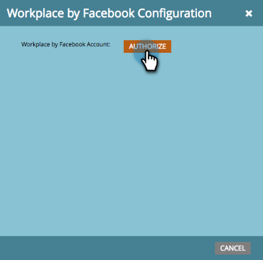

# 新增Workplace by Facebook as a LaunchPoint Service {#add-workplace-by-facebook-as-a-launchpoint-service}

工作區整合中包含兩種通知類型：

* **系統通知**:取得Marketo例項中重要事件的工作區通知，例如目前行銷活動狀態和任何需要立即注意的問題（CRM錯誤和API限制）的警報。
* **有趣的時刻**:當Marketo Insight由銷售帳戶的已知個人觸發時，銷售機會擁有者可透過工作區收到通知。 通知包括銷售機會資訊以及銷售帳戶的詳細資訊。

>[!NOTE]
>
>**需要管理權限**

>[!PREREQUISITES]
>
>如果您尚未啟用工作區通知，請聯繫 [Marketo支援](https://nation.marketo.com/t5/Support/ct-p/Support){target=&quot;_blank&quot;}。

1. 前往 **管理** 的上界。

   

1. 按一下 **LaunchPoint**.

   

1. 選擇 **新增** 然後 **新服務**.

   

1. 輸入工作區整合的顯示名稱。 在 **服務** 下拉式清單，選取 **facebook**. 按一下 **建立**。

   

1. 若要接收系統通知和有趣的時刻，請保留選項原樣。 按一下 **建立**。

   

1. 按一下 **授權**. 這會在新標籤中開啟「工作區」，您將在此完成授權並授予Marketo從工作區提取資訊的權限。

   

1. 在新的「工作場所」頁簽中，輸入您的企業電子郵件或「工作場所」用戶名，然後按一下 **繼續**.

   

1. 輸入您的工作場所憑據，然後按一下 **登入**.

   

1. 在「工作區」快顯視窗中，選擇您要張貼Marketo通知的Facebook群組（例如合作夥伴整合）。 按一下 **安裝**.

   

1. 您應會看到下方的確認通知。 標籤會自動關閉。

   

1. 重新整理Marketo標籤，並確認Workplace現在已在LaunchPoint中列為使用中服務。

   

   通知現在會開始張貼至您在步驟7中選取的Facebook群組。 它們看起來會像這樣：

   
