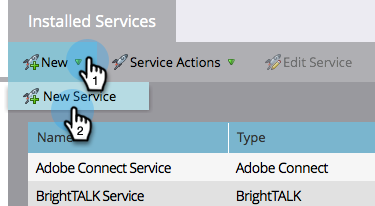

# 將[!DNL Zoom]新增為[!DNL LaunchPoint]服務 {#add-zoom-as-a-launchpoint-service}

Marketo會管理您的[!DNL Zoom]註冊和出席情況。

>[!NOTE]
>
>**需要管理員權限**

>[!NOTE]
>
>此步驟需要[!DNL Zoom]的現有訂閱和管理許可權。 擁有您用來登入[!DNL Zoom]的電子郵件和密碼。

1. 前往「**[!UICONTROL Admin]**」區域。

   

1. 按一下「**[!UICONTROL LaunchPoint]**」。

   

1. 選取&#x200B;**[!UICONTROL New]**，然後選取&#x200B;**[!UICONTROL New Service]**。

   

1. 輸入&#x200B;**[!UICONTROL Display Name]**。 在&#x200B;**[!UICONTROL Service]**&#x200B;下，選取&#x200B;**[!UICONTROL Zoom]**。

   

1. 按一下「**[!UICONTROL Log Into Zoom]**」。

   

1. 在[!DNL Zoom]登入視窗中，輸入您的[!DNL Zoom]認證並按一下&#x200B;**[!UICONTROL Sign in]**。

   

1. 視窗關閉後，按一下&#x200B;**[!UICONTROL Create]**。

   

您的[!DNL Zoom]帳戶現在已與Marketo同步，可以在[!UICONTROL LaunchPoint]區域找到。

>[!CAUTION]
>
>當您在[!DNL Zoom]中更新密碼時，也必須在Marketo中更新密碼。

>[!MORELIKETHIS]
>
>瞭解如何[使用 [!DNL Zoom]](/help/marketo/product-docs/demand-generation/events/create-an-event/create-an-event-with-zoom.md)建立事件。
