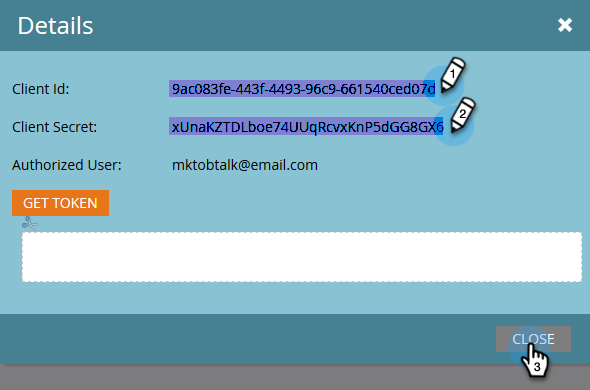

# 將BrightTALK連接到Marketo {#connect-brighttalk-to-marketo}

了解如何將BrightTALK管道連接至Marketo執行個體。 若要這麼做，您必須同時擔任這兩者的管理員。

>[!NOTE]
>
>**需要管理權限**

## BrightTALK中的步驟 {#steps-in-brighttalk}

1. 登入 [business.brighttalk.com/demandcentral](https://business.brighttalk.com/demandcentral/login){target=&quot;_blank&quot;}，按一下 **立即連接**.
1. 在「進階Marketo Connector」底下，按一下 **Connect**.
1. 您會前往憑證畫面，詢問：用戶端ID、用戶端密碼、身分服務URL及余留服務URL。 若要取得此資訊，請登入Marketo。

## Marketo步驟 {#steps-in-marketo}

>[!NOTE]
>
>此時，您必須設定「僅限API使用者角色」和「API使用者」，以限制BrightTALK在您的Marketo例項中將擁有的權限。 因為我們已經有這些步驟的文章，我們會將您連結至這些步驟。

1. 建立 [僅限API的使用者角色](/help/marketo/product-docs/administration/users-and-roles/create-an-api-only-user-role.md){target=&quot;_blank&quot;}。

1. [建立API使用者](/help/marketo/product-docs/administration/users-and-roles/create-an-api-only-user.md){target=&quot;_blank&quot;}，使用您在步驟4建立的BrightTALK API角色。

1. 返回「管理員」區域。

   

1. 在整合下方，按一下 **LaunchPoint**.

   

1. 按一下 **新增** 下拉式清單並選取 **新服務**.

   

1. 輸入您選擇的顯示名稱。 按一下「服務」下拉式清單，然後選取 **自訂** (do) _not_ 選擇BrightTALK)。

   

   >[!CAUTION]
   >
   >切記不要在下拉式清單中選取BrightTALK。 我們正在移除此欄位，選取此欄位可能會對您的Marketo/BrightTALK整合造成重大問題。

1. 輸入您選擇的說明。 按一下「僅API用戶」下拉清單，然後選擇在步驟5中建立的BrightTALK API用戶。 按一下 **建立**.

   

1. 按一下 **檢視詳細資料** 針對您剛建立的自訂服務。

   

1. 複製（並儲存） **用戶端ID** 和 **用戶端密碼**. 按一下 **關閉**.

   

1. 在「整合」下，選取 **網站服務**.

   

1. 在「Rest API」下，複製（並儲存） **端點** 和 **身分**.

   

## BrightTALK中的其他步驟 {#additional-steps-in-brighttalk}

1. 從步驟3返回BrightTALK連接器設定螢幕，並輸入從步驟12和14保存的憑據。

   驗證憑證後，您即已正式將BrightTALK連線至Marketo。 下一步是 [您要同步哪些資料欄位](https://support.brighttalk.com/hc/en-us/articles/115005131274-BrightTALK-Connector-for-Marketo-Choose-the-Fields-to-Sync){target=&quot;_blank&quot;}。
