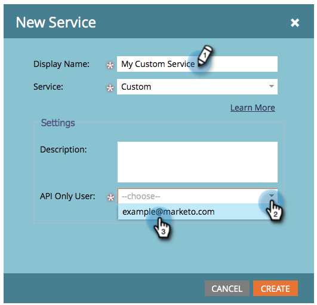
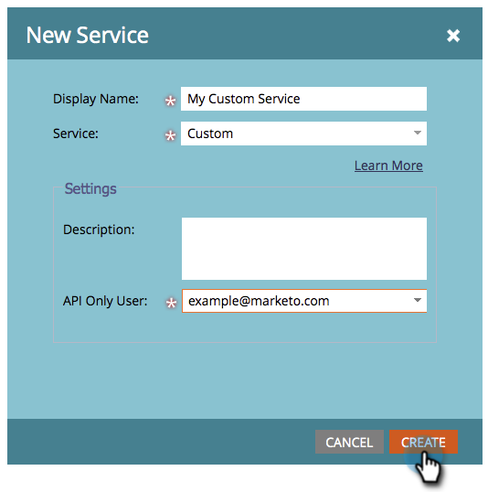

# 建立自訂服務以與ReST API搭配使用 {#create-a-custom-service-for-use-with-rest-api}

如果您想要透過ReST API與Marketo整合，請建立自訂服務。 方法如下。

>[!PREREQUISITES]
>
>* [建立僅限API的使用者角色](/help/marketo/product-docs/administration/users-and-roles/create-an-api-only-user-role.md)
>* [建立僅限API的使用者](/help/marketo/product-docs/administration/users-and-roles/create-an-api-only-user.md)
>

>[!NOTE]
>
>**需要管理員許可權**

>[!TIP]
>
>請檢視我們的開發人員檔案，以瞭解有關 [重設API](https://developers.marketo.com/documentation/rest/). 我們也有 [SOAP API](https://developers.marketo.com/documentation/soap/) 如果您需要的話。

## 建立自訂服務 {#create-custom-service}

1. 前往 **[!UICONTROL 管理員]** 區域。

   

1. 按一下 **啟動點**.

   

1. 選取 **[!UICONTROL 新增]** 然後 **[!UICONTROL 新服務]**.

   

1. 輸入 **[!UICONTROL 顯示名稱]** 用於此服務。 選取 **[!UICONTROL 僅API使用者]** [先前建立](/help/marketo/product-docs/administration/users-and-roles/create-an-api-only-user.md).

   

   >[!NOTE]
   >
   >請注意，我們已針對熱門的網路研討會服務進行原生整合。

1. 按一下 **[!UICONTROL 建立]**。

   

   噢，太棒了！ 服務現在已建立，讓我們繼續並取得提供存取權的所有認證。

## API存取的認證 {#credentials-for-api-access}

1. 前往 **[!UICONTROL 管理員]** 區域。

   

1. 按一下 **[!UICONTROL 啟動點]**.

   

1. 按一下 **[!UICONTROL 檢視詳細資料]** 用於自訂 [!UICONTROL 啟動點] 服務建立於上面。

   

1. 按一下 **[!UICONTROL 取得Token]**.

   

1. 提供 **[!UICONTROL 使用者端ID]**， **[!UICONTROL 使用者端密碼]**， **[!UICONTROL 授權使用者]**、和 **[!UICONTROL Token]** 給負責建立連線的人員。

   

>[!CAUTION]
>
>請勿共用此資訊；這是您資料的後門。 妥善保管！
