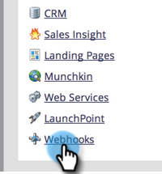

# 建立 [!DNL Webhook] {#create-a-webhook}

使用 [!DNL Webhooks] 善用協力廠商網站服務來傳送簡訊、擴充個人資料等。

>[!AVAILABILITY]
>
>並非所有客戶都已購買此功能。 請聯絡您的銷售代表以取得詳細資訊。

1. 前往 **[!UICONTROL 管理員]** 區域。

   

1. 按一下 **[!UICONTROL Webhooks]**.

   

1. 按一下 **[!UICONTROL 新Webhook]**.

   

1. 命名並設定您的 [!DNL Webhook].

   

   >[!NOTE]
   >
   >這通常包括以URL引數或POST範本的形式輸入您的協力廠商服務認證。

   * **[!UICONTROL URL]**：輸入您在向Web服務發出請求時使用的URL。 若要插入代號，例如人員的電子郵件地址(**`{{lead.Email Address}}`**)，在您的請求中，按一下 **[!UICONTROL 插入權杖]**.

   * **[!UICONTROL 範本]**：如果您想要在請求內文中傳輸資訊，請透過裝載範本輸入。 允許用於以下請求型別的範本：POST、DELETE、PATCH或PUT。 您可以使用JSON或XML等資料格式。 若要在範本中插入Token，請按一下 **[!UICONTROL 插入權杖]**.

   * **[!UICONTROL 請求權杖編碼]**：如果代號值包含特殊字元（例如&amp;符號、「&amp;」），請指出您請求的格式(**JSON** 或 **表單/URL**)。

   * **[!UICONTROL 回應型別]**：選取您從服務收到的回應格式(**JSON** 或 **XML**)。

   * **[!UICONTROL 請求型別]**：選取要使用的HTTP方法(DELETE、GET、PATCH、POST、PUT)。

1. 按一下 **[!UICONTROL 建立]**。

   

>[!NOTE]
>
>進一步瞭解 [[!DNL Webhooks]](https://developers.marketo.com/documentation/webhooks/){target="_blank"} 深度剖析。
