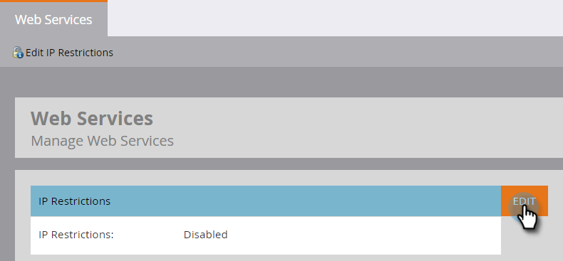
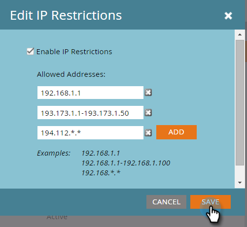

# 建立IP型API存取的允許清單 {#create-an-allowlist-for-ip-based-api-access}

有時，您只想讓API存取特定IP位址或一系列位址。 若要這麼做，請先啟用限制，然後指定允許使用API的IP位址。

>[!NOTE]
>
>**需要管理員權限**

1. 前往「管 **理員** 」並按一 **下「網站服務」**。

   

1. 在「IP限制」區域，按一下「**編輯」, **或按一下左上角** 「編輯IP限制」**。

   

1. 勾選「 **啟用IP限制** 」方塊，並輸入您要允許的IP位址。

   

   >[!NOTE]
   >
   >您可以輸入單一IP位址或其範圍，或使用萬用字元。

1. 按一 **下「新增** 」以開啟其他欄位，以輸入更多IP位址。

   

1. 按一下 **儲存**。

   

