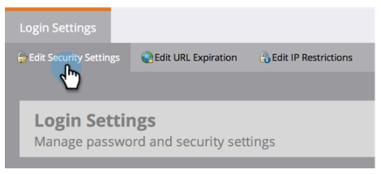

# 將使用者登入限製為僅限SSO {#restrict-user-login-to-sso-only}

如果您是 [使用SSO](/help/marketo/product-docs/administration/additional-integrations/add-single-sign-on-to-a-portal.md) 若要確保使用者無法略過SSO安全性，請遵循這些指示。

>[!IMPORTANT]
>
>本文不適用於 [Adobe IMS已啟用](/help/marketo/product-docs/administration/marketo-with-adobe-identity/adobe-identity-management-overview.md) Marketo訂閱。

>[!NOTE]
>
>**需要管理員許可權**

1. 前往 **[!UICONTROL 管理員]** 區域。

   

1. 按一下 **[!UICONTROL 登入設定]s**.

   

1. 按一下 **[!UICONTROL 編輯安全性設定]**.

   

1. 展開 **[!UICONTROL 進階]** 設定，檢查 **[!UICONTROL 需要SSO]**，然後按一下 **[!UICONTROL 儲存]**.

>[!NOTE]
>
>最佳實務建議邀請使用者並接受邀請。 _晚於_ 接受邀請，管理員應將邀請設為&quot;[!UICONTROL 需要SSO].」

>[!TIP]
>
>如果您選取 **[!UICONTROL 需要SSO]**，您可以排除 [使用者角色](/help/marketo/product-docs/administration/users-and-roles/create-delete-edit-and-change-a-user-role.md) 以檢查此限制 **[!UICONTROL 略過單一登入]** 選項。 這可讓使用者正常登入。 例如，管理員使用者可能仍需要透過登入畫面登入Marketo。

>[!CAUTION]
>
>邀請新使用者時，他們會收到邀請電子郵件。 但是，如果 **[!UICONTROL 需要SSO]** ，則不會收到這些電子郵件，除非已指派給設定為 **[!UICONTROL 略過單一登入]**.

完成了！ 現在，所有使用者（具有略過單一登入許可權的使用者除外）將限製為僅使用SSO登入。

>[!MORELIKETHIS]
>
>* [新增單一登入至入口網站](/help/marketo/product-docs/administration/additional-integrations/add-single-sign-on-to-a-portal.md)
>* [使用通用ID進行訂閱登入](/help/marketo/product-docs/administration/settings/using-a-universal-id-for-subscription-login.md)
>* [使用通用ID邀請Marketo使用者使用兩個執行個體](https://nation.marketo.com/t5/Knowledgebase/Inviting-Marketo-Users-to-Two-Instances-with-Universal-ID-UID/ta-p/251122)
