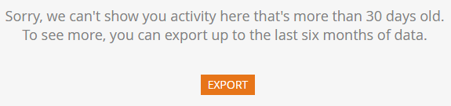

# 稽核軌跡概述 {#audit-trail-overview}

稽核軌跡可讓您取得Marketo執行個體中所做的變更的完整歷史記錄（六個月）。

>[!NOTE]
>
>稽核軌跡資料歷史記錄開始於2016年9月14日。

## 什麼是稽核軌跡 {#what-is-audit-trail}

稽核軌跡可以即時擷取Marketo訂閱中發生之動作和事件的完整清單。 其中包含自助式存取六個月歷史資料記錄，以協助回答下列問題：

此資產或設定有什麼改變，上次更新的是誰？

使用者X最近做了什麼？

誰正在登入我們的帳戶？

## 我們稽核的內容 {#what-we-audit}

Marketo將稽核 [建立、編輯和刪除](/help/marketo/product-docs/administration/audit-trail/change-details-in-audit-trail.md) 動作：

* Design Studio資產
* 所有Marketo計畫
* 智慧型行銷活動
* 清單（智慧/靜態）
* 使用者（管理員）
* 角色和許可權（管理員）
* 工作區與資料分割（管理員）
* 使用者登入記錄

>[!NOTE]
>
>Marketo是 _not_ 稽核目前在Web Personalization、預測性內容或Sales Insight中所做的變更。

## 稽核軌跡元件 {#audit-trail-components}

「稽核軌跡」包含三個元件。

**1) [資產稽核軌跡](/help/marketo/product-docs/administration/audit-trail/change-details-in-audit-trail.md#asset-audit-trail)**

請參閱對特定資產完成的活動。

**2) [管理員稽核軌跡](/help/marketo/product-docs/administration/audit-trail/change-details-in-audit-trail.md#admin-audit-trail)**

監視以使用者為基礎的詳細資訊。

**3) [使用者登入記錄](/help/marketo/product-docs/administration/audit-trail/user-login-history.md)**

檢視哪些使用者已登入您的訂閱，以及何時登入。 也包括失敗的登入嘗試。

>[!TIP]
>
>您可以使用稽核軌跡稽核的次數太多，請務必利用 [篩選](/help/marketo/product-docs/administration/audit-trail/filtering-in-audit-trail.md)！

## 匯出資料 {#exporting-data}

您只能檢視執行個體中30天的資料。 若要取得（最多）六個月的值，請使用匯出選項。

>[!NOTE]
>
>**定義**
>
>**未知：** 在 [!DNL Webhook]，您可能會看到使用者的名稱和電子郵件列為「未知」。 當您在CRM中變更選擇清單值時，就會發生此情況。 這些值會顯示在Marketo表單和登入頁面中。 在CRM端執行此更新將會自動草稿您的登入頁面參考表單。 在 [!DNL Webhook]，我們會擷取登入頁面為草稿，但使用者的名稱和電子郵件會顯示為「未知」，因為我們無法從CRM端擷取使用者資訊。

>[!MORELIKETHIS]
>
>[啟用稽核軌跡](/help/marketo/product-docs/administration/audit-trail/enable-audit-trail.md)
