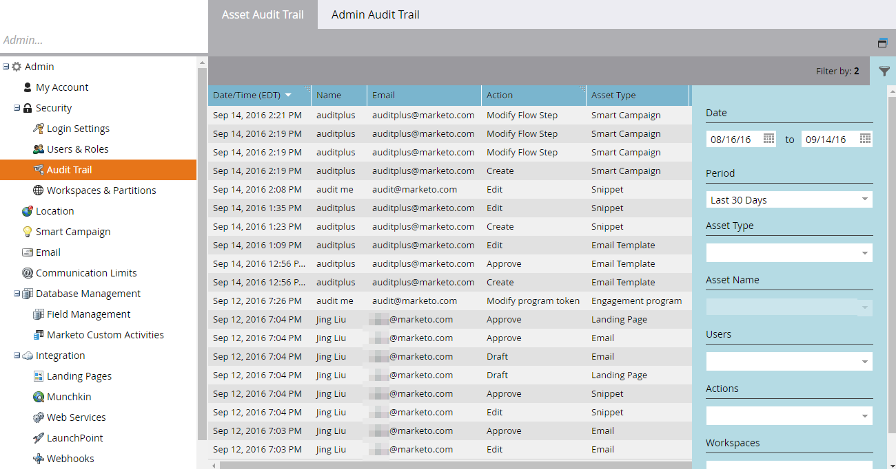

# 稽核軌跡概述 {#audit-trail-overview}

稽核軌跡可讓您取得在Marketo執行個體中所做變更的完整記錄（6個月內）。

>[!NOTE]
>
>稽核軌跡資料歷史記錄可從2016年9月14日開始。

## 什麼是稽核軌跡 {#what-is-audit-trail}

稽核軌跡會即時擷取在Marketo訂閱中發生之動作和事件的完整清單。 其中包括自助式存取六個月的資料記錄，以協助回答下列問題：

此資產或設定有什麼改變，上次更新的是誰？

X用戶做了什麼？

誰正在登錄我們的帳戶？

## 我們稽核的項目 {#what-we-audit}

Marketo將審核 [建立、編輯和刪除](/help/marketo/product-docs/administration/audit-trail/change-details-in-audit-trail.md) 的動作：

* 設計工作室資產
* 所有Marketo方案
* 智慧型行銷活動
* 清單（智慧/靜態）
* 使用者（管理員）
* 角色與權限（管理員）
* 工作區和分區（管理員）
* 使用者登入歷史記錄

>[!NOTE]
>
>Marketo _not_ 目前在「Web個人化」、「預測內容」或「銷售分析」中進行的稽核變更。

## 稽核軌跡元件 {#audit-trail-components}

稽核軌跡包含三個元件。

**1) [資產稽核軌跡](/help/marketo/product-docs/administration/audit-trail/change-details-in-audit-trail.md#asset-audit-trail)**

請參閱對特定資產完成的活動。

**2) [管理員稽核軌跡](/help/marketo/product-docs/administration/audit-trail/change-details-in-audit-trail.md#admin-audit-trail)**

監視基於用戶的詳細資訊。

**3) [使用者登入歷史記錄](/help/marketo/product-docs/administration/audit-trail/user-login-history.md)**

了解哪些人已登入您的訂閱，以及登入時間。 還包括失敗的登錄嘗試。

>[!TIP]
>
>您可以使用稽核軌跡進行稽核的次數如此之多，請務必善用 [篩選](/help/marketo/product-docs/administration/audit-trail/filtering-in-audit-trail.md)!

## 匯出資料 {#exporting-data}

您只能在執行個體中檢視30天的資料。 若要獲得（最多）六個月的價值，請使用匯出選項。

>[!NOTE]
>
>**定義**
>
>**未知：** 在稽核追蹤中，您可能會看到使用者的名稱和電子郵件列為「未知」。 當您在CRM中變更選擇清單值時，就會發生此情況。 這些值會顯示在Marketo表單和登錄頁面中。 在CRM端執行此更新會自動草擬參考表單的登錄頁面。 在稽核追蹤中，我們會擷取登錄頁面已起草，但使用者的名稱和電子郵件將顯示為「未知」，因為我們無法從CRM端擷取使用者資訊。

>[!MORELIKETHIS]
>
>[啟用審核跟蹤](/help/marketo/product-docs/administration/audit-trail/enable-audit-trail.md)
