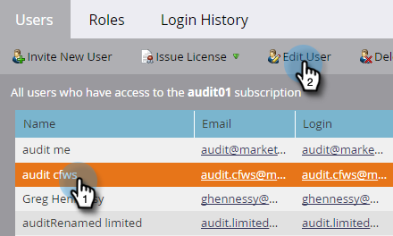

# 啟用稽核軌跡 {#enable-audit-trail}

稽核軌跡可供所有客戶使用，並受兩個管理員許可權控制。

>[!NOTE]
>
>依預設，所有系統管理員角色都會啟用這兩個許可權。

## 啟用角色的稽核軌跡 {#enable-audit-trail-for-a-role}

1. 按一下 **[!UICONTROL 管理員]**.

   

1. 選取 **[!UICONTROL 使用者和角色]** 並按一下 **[!UICONTROL 角色]**.

   

1. 選取您要啟用稽核軌跡的角色，然後按一下 **[!UICONTROL 編輯角色]**.

   

   >[!NOTE]
   >
   >您也可以在這裡選擇建立新角色，並授予其稽核軌跡存取權。

1. 展開 **[!UICONTROL 存取管理員]** 許可權。 選取 **[!UICONTROL 存取稽核軌跡]** 和/或 **[!UICONTROL 存取登入記錄]**，視您的需求而定。 按一下 **[!UICONTROL 儲存]**.

   

   >[!NOTE]
   >
   >**定義**
   >
   >**[!UICONTROL 存取稽核軌跡]**：讓使用者同時存取兩者 [!UICONTROL 資產稽核軌跡] 和 [!UICONTROL 管理員稽核軌跡].
   >
   >**[!UICONTROL 存取登入記錄]**：讓使用者存取 [使用者登入記錄](/help/marketo/product-docs/administration/audit-trail/user-login-history.md).

## 指派稽核軌跡角色給使用者 {#assign-audit-trail-role-to-a-user}

>[!PREREQUISITES]
>
>[建立](/help/marketo/product-docs/administration/users-and-roles/create-delete-edit-and-change-a-user-role.md#create-a-role) 或 [啟用](#enable-audit-trail) 現有角色，為其授予稽核軌跡許可權。

1. 在 **[!UICONTROL 使用者和角色]**，按一下 **[!UICONTROL 使用者]**.

   

1. 選取您要授與稽核軌跡存取權的使用者，然後按一下 **[!UICONTROL 編輯使用者]**.

   

   >[!NOTE]
   >
   >建立新使用者時，此程式也適用。

1. 選取您建立的稽核軌跡角色。 在此範例中，我們建立了「稽核軌跡 — 資產與管理員」和「稽核軌跡 — 包含登入歷史記錄」。

   

   >[!CAUTION]
   >
   >如果您已啟用工作區，請務必勾選角色的核取方塊，以選取所有工作區。 取消選取個別工作區將會隱藏稽核軌跡。 這表示您會看到每個工作區的稽核軌跡資料。 您確實可以選擇在下列情況下隱藏工作區 [篩選](/help/marketo/product-docs/administration/audit-trail/filtering-in-audit-trail.md).

1. 按一下 **[!UICONTROL 儲存]**.

   
