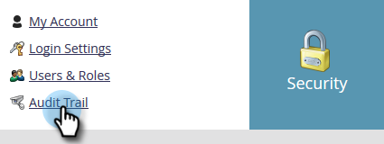

# 稽核軌跡中的篩選 {#filtering-in-audit-trail}

依時間範圍、資產類型、使用者、採取的動作等進行篩選。

1. 按一下 **管理**.

   

1. 在 **安全性**，選取 **稽核軌跡**.

   

1. 按一下篩選圖示。

   

   >[!NOTE]
   >
   >可能的搜尋參陣列合有許多種。 在此範例中，我們會找出： _前七天內的所有電子郵件（由任何人編輯）_.

1. 按一下 **時段** 下拉式清單並選取 **最近7天**.

   

1. 按一下 **資產類型** 下拉式清單並選取 **電子郵件**.

   

1. 按一下 **動作** 下拉式清單並選取 **編輯**.

   

1. 按一下 **套用**.

   

1. 篩選的結果會顯示在左側。

   

   就這樣！

   >[!NOTE]
   >
   >如果您已啟用工作區，則會看到所有工作區的稽核資料。 如果您套用工作區篩選，Marketo會在您每次使用稽核追蹤時記住先前的工作區值。 資產層級的工作區權限會強制執行。

   >[!MORELIKETHIS]
   >
   >[更改審核跟蹤中的詳細資訊](/help/marketo/product-docs/administration/audit-trail/change-details-in-audit-trail.md)
