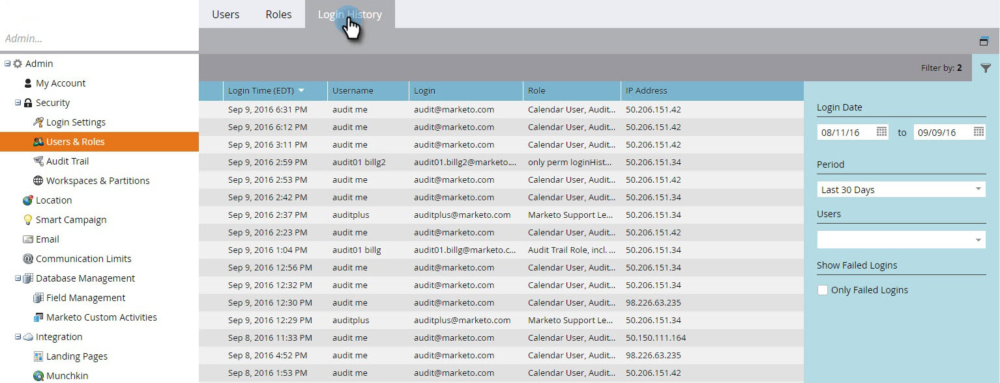

# 使用者登入歷史記錄 {#user-login-history}

「使用者登入歷史記錄」會向您顯示登入訂閱的確切人員，包括失敗的登入嘗試，協助您維護責任和安全性。

>[!PREREQUISITES]
>
>您必須擁有已啟用「存取登入歷程記錄」許可權的角色，才能檢視「使用者登入歷程記錄」。

「使用者登入歷史記錄」可識別以下人員登入：

* 登入時間和日期
* 使用者名稱和電子郵件地址
* 角色
* 工作區
* IP位址

若要檢視使用者登入歷史記錄：

1. 前往「**[!UICONTROL Admin]**」區域。

   

1. 在[安全性]下，按一下[**[!UICONTROL Users & Roles]**]。

   

1. 按一下「**[!UICONTROL Login History]**」索引標籤。 此清單會顯示最近登入。

   

1. 使用「篩選」來縮小搜尋範圍。

   

1. 使用日期選擇器選取日期範圍。

   

1. 或從下拉式清單中選擇。

   

1. 從&#x200B;**[!UICONTROL Users]**&#x200B;下拉式清單中選取使用者。

   

1. 勾選&#x200B;**[!UICONTROL Only Failed Logins]**&#x200B;方塊以僅顯示搜尋中失敗的登入。

   

1. 按一下「**[!UICONTROL Apply]**」。

   

   >[!NOTE]
   >
   >使用者介面會顯示最多30天的資料。 如果您需要更多資訊，可以將最近六個月的資料下載到CSV檔案中。

   >[!MORELIKETHIS]
   >
   >[稽核軌跡概觀](/help/marketo/product-docs/administration/audit-trail/audit-trail-overview.md)
