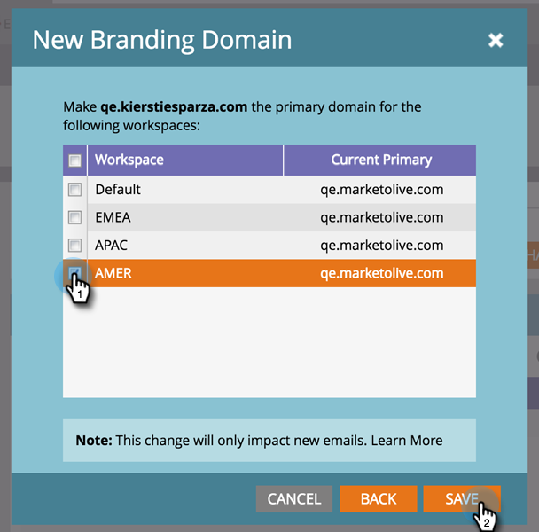

# 使用工作區新增其他品牌化網域 {#add-an-additional-branding-domain-with-workspaces}

如果您有工作區，您可以新增其他品牌化網域。

>[!PREREQUISITES]
>
>您必須先[編輯預設品牌化網域](/help/marketo/product-docs/administration/email-setup/add-multiple-branding-domains/edit-your-default-branding-domain.md)。
>
>您必須先以品牌化網域取代一般追蹤連結[，才能新增其他品牌化網域。](/help/marketo/product-docs/administration/email-setup/add-multiple-branding-domains/edit-your-default-branding-domain-with-workspaces.md)

1. 前往「**[!UICONTROL Admin]**」區域。

   

1. 按一下「**[!UICONTROL Email]**」。

   

1. 按一下&#x200B;**[!UICONTROL Add]**&#x200B;以新增其他品牌化網域。

   

1. 輸入新的品牌化網域。 按一下「**[!UICONTROL Next]**」。

   

   >[!NOTE]
   >
   >您可以選擇將此設定為一個或多個工作區的主要網域，並且所有現有未傳送電子郵件都設為「預設」，所有新建立的電子郵件都預設為主要網域。 您可以根據每封電子郵件覆寫此專案。

1. 選取新品牌化網域，然後按一下&#x200B;**[!UICONTROL Save]**。

   
