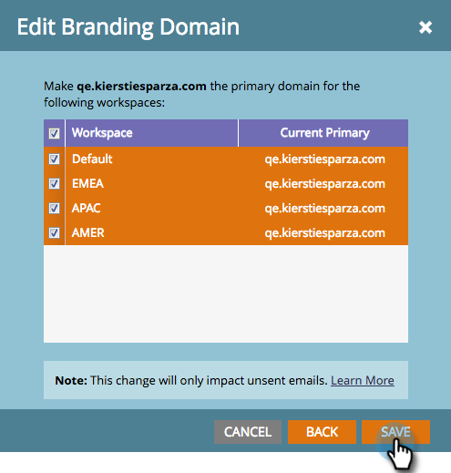

# 使用工作區編輯您的預設品牌化網域 {#edit-your-default-branding-domain-with-workspaces}

1. 前往「**[!UICONTROL Admin]**」區域。

   

1. 按一下「**[!UICONTROL Email]**」。

   

1. 在[!UICONTROL Branding Domains]表格中，選取目前的一般網域，然後按一下&#x200B;**[!UICONTROL Edit]**&#x200B;以將其變更為您公司的品牌網域。

   

   >[!NOTE]
   >
   >在您編輯一般網域之前，**[!UICONTROL Add]**&#x200B;無法運作。 在您新增第二個網域之前，**[!UICONTROL Delete]**&#x200B;無法運作。
   >
   >您必須先編輯一般領域，才能新增其他領域。

1. 輸入預設網域的名稱，然後按一下&#x200B;**[!UICONTROL Next]**。

   

1. 按一下「**[!UICONTROL Save]**」。

   

>[!NOTE]
>
>新增其他商標網域時，您可以選擇將此網域設為主要網域，以供一個或多個工作區使用，且所有現有未傳送電子郵件都會設為「預設」，而所有新建立的電子郵件都會預設為主要網域。 您可以根據每封電子郵件覆寫此專案。

現在，您可以[新增工作區所需的其他品牌網域](/help/marketo/product-docs/administration/email-setup/add-multiple-branding-domains/add-an-additional-branding-domain-with-workspaces.md)。
