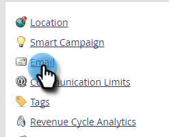

# 編輯您的預設品牌化網域 {#edit-your-default-branding-domain}

編輯您的預設品牌領域是使用品牌領域的第一步。

>[!PREREQUISITES]
>
>確定您已 [在您的DNS中設定CNAME](/help/marketo/getting-started/setup/configure-protocols-for-marketo.md) 在Marketo中新增品牌化網域之前。

1. 前往 **[!UICONTROL 管理員]** 區域。

   

1. 按一下 **[!UICONTROL 電子郵件]**.

   

1. 在 [!UICONTROL 品牌化網域] 表格中，選取一般領域並按一下「編輯」以將其變更為您公司的品牌領域。

   

   >[!NOTE]
   >
   >您必須先編輯一般網域，才能新增其他網域。

1. 輸入預設網域的名稱，然後按一下 **[!UICONTROL 儲存]**.

   

現在，您可以 [新增任何其他品牌化網域](/help/marketo/product-docs/administration/email-setup/add-multiple-branding-domains/add-an-additional-branding-domain.md) 您需要。
