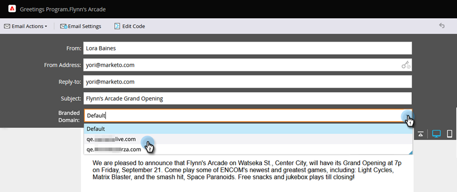

# 覆寫電子郵件的主要網域 {#overwrite-primary-domain-for-emails}

您可以根據每封電子郵件覆寫主要品牌網域。 這會變更傳送電子郵件時連結的品牌化方式。

1. 前往 **[!UICONTROL Marketing Activities]**。

   

1. 選取電子郵件並按一下&#x200B;**[!UICONTROL Edit Draft]**。

   

1. 選取您要使用的品牌化網域。

   

   >[!NOTE]
   >
   >並非所有使用者都有權根據每封電子郵件設定品牌化網域。 如果您看不到[!UICONTROL Branded Domains]下拉式清單，請聯絡管理員。
