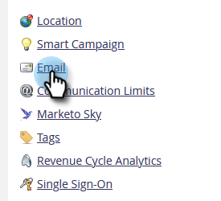

# 變更自訂物件擷取限制 [!DNL Velocity Scripting] {#change-custom-object-retrieval-limits-in-velocity-scripting}

如果您使用 [!DNL Velocity Script] 若要在電子郵件中顯示自訂物件資料，您可能適合使用此功能。 預設情況下，您可以從Velocity指令碼存取10個父系自訂物件。 如果您需要存取更多資訊，請閱讀。

## 什麼是 [!DNL Velocity] {#what-is-velocity}

[[!DNL Apache Velocity]](https://velocity.apache.org/) 是建置在上的語言 [!DNL Java] 專為範本化和指令碼HTML內容所設計。 Marketo可讓您透過使用將其用於電子郵件內容中 [指令碼Token](/help/marketo/product-docs/email-marketing/general/using-tokens/create-an-email-script-token.md). 除了其他功能以外，這還可以讓您存取儲存在自訂物件中的資料。

您可以參照直接連線至Lead或Contact的父項和子項自訂物件，但不能參照第三級自訂物件。 對於每個自訂物件，每個人員/聯絡人的10個最近更新記錄在執行階段可用，並且按照從最近更新（在0點）到最舊更新（在9點）的順序排列。

## 如何變更限制 {#how-to-change-the-limit}

1. 前往 **[!UICONTROL 管理員]** 區段。

   

1. 按一下 **[!UICONTROL 電子郵件]**.

   

1. 在 [!UICONTROL 自訂物件擷取限制] 表格，輸入新的 [!UICONTROL 上層擷取限制] 並按一下 **[!UICONTROL 儲存變更]**.

   

>[!NOTE]
>
>此 [!UICONTROL 上層擷取限制] 值必須在10到100的範圍內。 此 [!UICONTROL 子擷取限制] 會自動為您設定。 這是以1000除以 [!UICONTROL 上層擷取限制]. 例如，如果您將父限制設為50，子限制會變成20 (1000 ÷ 50 = 20)。

很好！ 您現在可以從存取更多自訂物件 [!DNL Velocity script].
