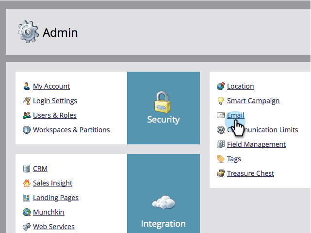

# 變更預設的寄件者電子郵件和寄件者標籤 {#change-the-default-from-email-and-from-label}

每位管理員使用者都可以變更&#x200B;**[!UICONTROL From Email]**&#x200B;和&#x200B;**[!UICONTROL From Label]**&#x200B;的預設值，以便在他們建立新電子郵件時，使用這些預設值。

>[!NOTE]
>
>**需要管理員權限**

1. 移至&#x200B;**[!UICONTROL Admin]**&#x200B;區段。

   

1. 按一下「**[!UICONTROL Email]**」。

   

1. 輸入您想要的&#x200B;**[!UICONTROL From Email]**&#x200B;和&#x200B;**[!UICONTROL From Label]**&#x200B;預設值，然後按一下&#x200B;**[!UICONTROL Save Changes]**。

   

>[!NOTE]
>
>這項變更僅適用於您，不適用於其他Marketo使用者。

現在，每次建立新電子郵件時，都會使用您設定的預設值。
