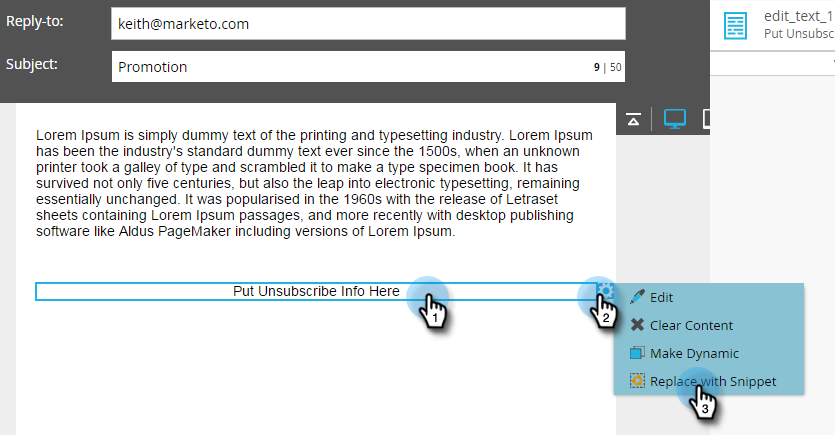

# 讓您的取消訂閱訊息成為語言的動態訊息 {#make-your-unsubscribe-message-dynamic-for-languages}

預設的取消訂閱訊息和連結為英文。 您可以使用動態內容以不同語言顯示。

>[!NOTE]
>
>本文代表最佳實務，但可以用其他方式完成。

## 準備您的資料 {#prepare-your-data}

1. [建立名為「偏好語言」的自訂欄位](/help/marketo/product-docs/administration/field-management/create-a-custom-field-in-marketo.md)。 （如果您想要同步此欄位，請在CRM中進行設定）。

   >[!TIP]
   >
   >日後當您[建立表單](/help/marketo/product-docs/demand-generation/forms/creating-a-form/create-a-form.md)以擷取語言偏好設定時，請使用此欄位。

## 建立細分 {#create-segmentation}

1. 移至&#x200B;**[!UICONTROL 資料庫]**。

   

1. 在&#x200B;**[!UICONTROL 新]**&#x200B;下拉式清單中，按一下&#x200B;**[!UICONTROL 新區段]**。

   

1. 將區段&#x200B;**[!UICONTROL 命名為偏好語言]**。 按一下&#x200B;**[!UICONTROL 新增區段]**。 輸入語言。

   

   >[!NOTE]
   >
   >預設區段將為英文。

1. 繼續新增區段，直到所有語言皆有呈現為止。 按一下&#x200B;**[!UICONTROL 建立]**。

   

1. 選取區段。

   

1. 移至&#x200B;**[!UICONTROL 智慧清單]**&#x200B;標籤。 在搜尋欄位中輸入&#x200B;**[!UICONTROL 偏好的語言]**。 將篩選器拖放至畫布上。

   

1. 設定適當的對應語言。

   

1. 對所有不同的語言重複此步驟。 接著，選取&#x200B;**[!UICONTROL 分段動作]**&#x200B;下拉式清單，然後按一下&#x200B;**[!UICONTROL 核准]**。

   

## 建立代碼片段 {#create-a-snippet}

1. 移至&#x200B;**[!UICONTROL 設計工作室]**。

   

1. 在&#x200B;**[!UICONTROL 新增]**&#x200B;下拉式清單中，按一下&#x200B;**[!UICONTROL 新增程式碼片段]**。

   

1. 將程式碼片段命名為&#x200B;**取消訂閱訊息**。 按一下&#x200B;**[!UICONTROL 建立]**。

   

1. 輸入預設的取消訂閱訊息，反白該訊息，然後按一下超連結圖示。

   

1. 將這個Token： `{{system.unsubscribeLink}}`複製並貼到&#x200B;**[!UICONTROL URL]**&#x200B;欄位中。 按一下&#x200B;**[!UICONTROL 插入]**。

   

1. 在&#x200B;**[!UICONTROL 區段]**&#x200B;區段中選取&#x200B;**[!UICONTROL 區段依據]**。

   

1. 從&#x200B;**[!UICONTROL 分段]**&#x200B;下拉式清單中，輸入&#x200B;**[!UICONTROL 偏好的語言]**，並選取&#x200B;**[!UICONTROL 偏好的語言]**。 按一下&#x200B;**[!UICONTROL 保存]**。

   

1. 從樹狀結構中選取區段。 按一下您的取消訂閱，然後按一下連結圖示。

   

1. 確定`{{system.unsubscribeLink}}`仍在&#x200B;**[!UICONTROL URL]**&#x200B;欄位中。 編輯&#x200B;**[!UICONTROL 顯示文字]**&#x200B;以符合您選取的語言。 按一下&#x200B;**[!UICONTROL 套用]**。

   

1. 對所有區段重複。 接著，返回&#x200B;**[!UICONTROL Design Studio]**，按一下&#x200B;**[!UICONTROL 程式碼片段動作]**&#x200B;下拉式清單，然後按一下&#x200B;**[!UICONTROL 核准]**。

   

棒極了！ 即將完成！

## 在電子郵件中使用程式碼片段 {#use-snippet-in-an-email}

1. 在電子郵件編輯器中，按一下可編輯的元素。 然後按一下齒輪圖示並選取&#x200B;**[!UICONTROL 以程式碼片段取代]**。 如果您要選取可編輯的程式碼片段元素，請按一下齒輪圖示並選取&#x200B;**[!UICONTROL 編輯]**。

   

1. 從下拉式清單中尋找並選取您的程式碼片段，然後按一下&#x200B;**[!UICONTROL 儲存]**。

   

1. 若要測試它，請按一下[上一步]。**&#x200B;**...

   

1. ...然後&#x200B;**[!UICONTROL 動態]**&#x200B;索引標籤。

   

1. 按一下不同的語言以檢視程式碼片段變更。

   

   >[!TIP]
   >
   >當然，您也可以針對動態語言編輯電子郵件的其餘部分。 在您執行此操作時，請在取消訂閱頁面上執行相同的技巧。

## 使用動態內容自訂您的取消訂閱頁面 {#customizing-your-unsubscribe-page-with-dynamic-content}

如果您希望您的人員以偏好語言進入取消訂閱頁面，您可以使用登入頁面和確認頁面上的動態內容。

1. 瀏覽至&#x200B;**[!UICONTROL 設計工作室]**。

   

1. 在搜尋欄位中輸入&#x200B;_取消訂閱_，然後選取您想要的[取消訂閱]頁面。

   

1. 按一下&#x200B;**[!UICONTROL 編輯草稿]**。

   

1. 選取&#x200B;**[!UICONTROL 分段依據]**。

   

1. 尋找&#x200B;**[!UICONTROL 偏好的語言]**&#x200B;區段。 按一下&#x200B;**[!UICONTROL 保存]**。

   

   編輯每個登入頁面的內容、核准，一切準備就緒！

   >[!NOTE]
   >
   >深入瞭解[動態內容](/help/marketo/product-docs/personalization/segmentation-and-snippets/segmentation/understanding-dynamic-content.md)以及您可以做的所有有趣事。
