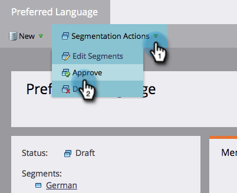
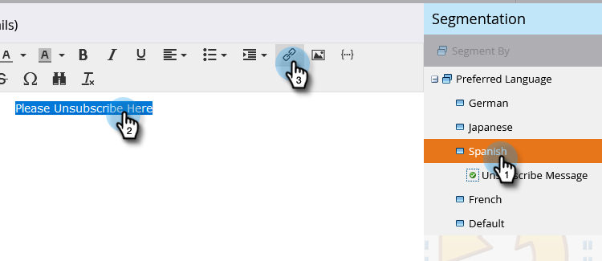
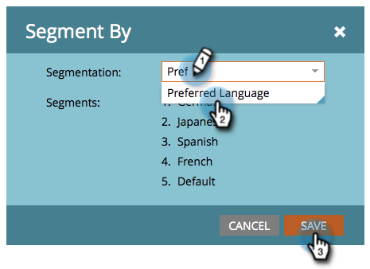

# 讓您的取消訂閱訊息動態顯示語言 {#make-your-unsubscribe-message-dynamic-for-languages}

預設的取消訂閱訊息和連結為英文。 您可以使用動態內容以不同語言顯示。

>[!NOTE]
>
>本文是最佳實務，但可以以其他方式完成。

## 準備資料 {#prepare-your-data}

1. [建立自訂欄位](/help/marketo/product-docs/administration/field-management/create-a-custom-field-in-marketo.md) 名為「首選語言」。 （如果您希望此欄位同步，請在CRM中設定）。

   >[!TIP]
   >
   >未來，請在您 [建立表單](/help/marketo/product-docs/demand-generation/forms/creating-a-form/create-a-form.md) 來擷取語言偏好設定。

## 建立區段 {#create-segmentation}

1. 前往 **資料庫**.

   

1. 在 **新增** 下拉式清單，按一下 **新細分**.

   

1. 為區段命名 **首選語言**. 按一下 **新增區段**. 輸入語言。

   

   >[!NOTE]
   >
   >預設區段為英文。

1. 繼續新增區段，直到所有語言都顯示完為止。 按一下 **建立**。

   

1. 選取區段。

   

1. 前往 **智慧清單** 標籤。 輸入 **首選語言** 填入搜尋欄位。 將篩選器拖放至畫布上。

   

1. 設定適當的對應語言。

   

1. 對所有不同的語言重複。 然後，選取 **區段動作** 下拉式清單，按一下 **核准**.

   

## 建立程式碼片段 {#create-a-snippet}

1. 前往 **Design Studio**.

   

1. 在 **新增** 按一下下拉式清單 **新程式碼片段**.

   

1. 為程式碼片段命名 **取消訂閱消息**. 按一下 **建立**。

   

1. 輸入預設的取消訂閱消息，突出顯示它，然後按一下超連結表徵圖。

   

1. 複製並貼上此代號： `{{system.unsubscribeLink}}` 進入 **URL** 欄位。 按一下 **插入**.

   

1. 選擇 **區段依據** 在「細分」區段中。

   

1. 從「細分」下拉式清單中，輸入 **首選** 選取 **首選語言**. 按一下 **儲存**.

   

1. 從樹中選取區段。 按一下您的取消訂閱，然後按一下連結圖示。

   

1. 請確定 `{{system.unsubscribeLink}}` 仍在URL欄位中。 編輯「顯示文字」以符合您選取的語言。 按一下 **套用**.

   

1. 對所有區段重複。 然後，返回Design Studio，按一下 **程式碼片段動作** 下拉式清單，然後按一下 **核准**.

   

太棒了。 快到了！

## 在電子郵件中使用程式碼片段 {#use-snippet-in-an-email}

1. 在電子郵件編輯器內，按一下可編輯的元素。 然後按一下齒輪圖示並選取 **以程式碼片段取代**. 如果您選取的是可編輯的程式碼片段元素，請按一下齒輪圖示並選取 **編輯**.

   

1. 從下拉式清單中尋找並選取程式碼片段，然後按一下 **儲存**.

   

1. 若要測試，請按一下 **返回**...

   

1. ...然後 **動態** 標籤。

   

1. 按一下不同的語言，即可查看程式碼片段變更。

   

   >[!TIP]
   >
   >當然，您也可以編輯電子郵件的其餘部分，以使用動態語言。 雖然您正在使用，但請在「取消訂閱」頁面上執行相同的技巧。

## 使用動態內容自訂您的取消訂閱頁面 {#customizing-your-unsubscribe-page-with-dynamic-content}

如果您希望您的人員以其偏好的語言進入取消訂閱頁面，您可以在登錄頁面和確認頁面上使用動態內容。

1. 導覽至 **Design Studio**.

   

1. 輸入 _取消訂閱_ 在搜尋欄位中，選取您想要的「取消訂閱」頁面。

   

1. 按一下 **編輯草稿**.

   

1. 選擇 **區段依據**.

   

1. 尋找「偏好語言」區段。 按一下 **儲存**.

   

   編輯每個登錄頁面的內容、核准後即可開始！

   >[!NOTE]
   >
   >深入了解 [動態內容](/help/marketo/product-docs/personalization/segmentation-and-snippets/segmentation/understanding-dynamic-content.md) 還有你能做的一切。
