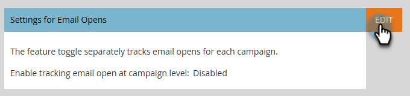

# 行銷活動層級的電子郵件開啟追蹤 {#email-open-tracking-at-campaign-level}

此功能可讓您控制追蹤電子郵件開啟次數，針對行銷活動中的每次開啟控制一次，或針對每封電子郵件控制一次，無論其用於不同行銷活動中的次數為何。

>[!NOTE]
>
>**需要管理員許可權**

1. 移至&#x200B;**管理員**&#x200B;區域。

   

1. 按一下&#x200B;**智慧型行銷活動**。

   

1. 在&#x200B;_電子郵件開啟設定_&#x200B;旁邊，按一下&#x200B;**編輯**。

   

1. 按一下下拉式清單，選擇您想要的設定，然後按一下[儲存]。****

   

<table><tbody>
  <tr>
    <td><b>啟用</b></td>
    <td>系統會分別追蹤每個行銷活動的電子郵件開啟次數。</td>
  </tr>
  <tr>
    <td><b>停用</b></td>
    <td>電子郵件開啟次數只會根據不重複人員開啟次數計算。</td>
  </tr>
</tbody>
</table>
