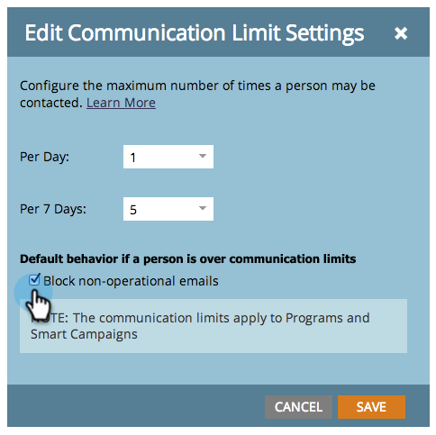

# 啟用通訊限制 {#enable-communication-limits}

不要與您的人員過度溝通非常重要。 設定通訊限制有助於防止貴組織傳送過多電子郵件。

>[!NOTE]
>
>**需要管理員權限**

1. 在「管 **理員**」下，按一 **下「通訊限制**」。

   
按一下「編輯」。
   

   >[!NOTE]
   >
   >
   >「每日」是根據訂閱時區（午夜——午夜）中的日曆日。

1. 按一下 **「每日** 」下拉式清單，並選取所要的限制。 在本例中，我們選擇1。

   

   >[!TIP]
   >
   >如果預設集選 **項不適用** ，您也可以選擇「自訂」。

1. 按一 **下「每7天** 」下拉式清單，並選取所要的限制。 在此示例中，我們選擇5。

   

1. 選擇 **阻止非操作電子郵件**。

   

   >[!NOTE]
   >
   >進一步瞭解哪些 [是營運電子郵](http://docs.marketo.com/display/DOCS/Make+an+Email+Operational) 件。

1. 按一下 **儲存**。

   

   >[!NOTE]
   >
   >**範例**
   >
   >
   >上述設定表示在任何七天期間內，每 **天不會收到超過** 1封或 **超過5封電子郵件**。

   >[!NOTE]
   >
   >
   >通訊限制會自動套用至所有電子郵件和參與計畫。

>[!MORELIKETHIS]
>
>[將通訊限制套用至智慧型促銷活動](../../../product-docs/core-marketo-concepts/smart-campaigns/using-smart-campaigns/apply-communication-limits-to-smart-campaign.md)

