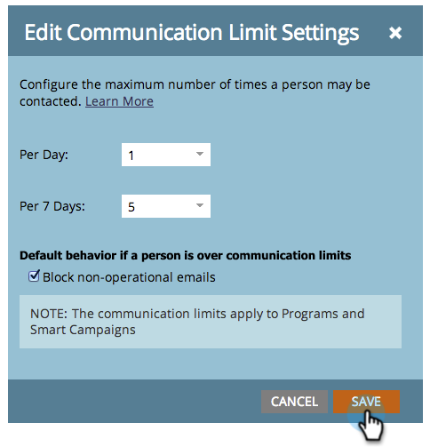

# 啟用通訊限制 {#enable-communication-limits}

切勿與員工過度溝通。 設定通訊限制有助於防止您的組織傳送過多電子郵件。

>[!NOTE]
>
>**需要管理員權限**

1. 前往「**[!UICONTROL Admin]**」區域。

   

1. 按一下「**[!UICONTROL Communication Limits]**」。

   

1. 按一下「**[!UICONTROL Edit]**」。

   

   >[!NOTE]
   >
   >[!UICONTROL Per Day]是以訂閱時區的行事曆日期為基礎（午夜 — 午夜）。

1. 按一下&#x200B;**[!UICONTROL Per Day]**&#x200B;下拉式清單，然後選取想要的限制。 在此範例中，使用1。

   

   >[!TIP]
   >
   >如果預設集選項都不適合您，您也可以選擇&#x200B;**[!UICONTROL Custom]**。

1. 按一下&#x200B;**[!UICONTROL Per 7 Days]**&#x200B;下拉式清單，然後選取想要的限制。 在此範例中，使用5。

   

1. 選取「**[!UICONTROL Block non-operational emails]**」。

   

   >[!NOTE]
   >
   >深入瞭解[營運電子郵件](/help/marketo/product-docs/email-marketing/general/functions-in-the-editor/make-an-email-operational.md)的內容。

1. 按一下「**[!UICONTROL Save]**」。

   

   >[!NOTE]
   >
   >**範例**
   >
   >上述設定表示在任何七天期間&#x200B;**內，使用者每天不會收到超過** 1封電子郵件&#x200B;**或超過** 5封。

   >[!NOTE]
   >
   >通訊限制會自動套用至所有電子郵件和參與程式。

>[!MORELIKETHIS]
>
>[將通訊限制套用至 [!DNL Smart Campaign]](/help/marketo/product-docs/core-marketo-concepts/smart-campaigns/using-smart-campaigns/apply-communication-limits-to-smart-campaign.md)
