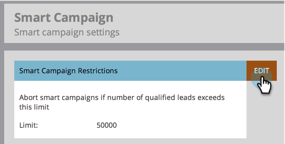

# 啟用智慧型促銷活動的人員限制{#enable-person-restrictions-for-smart-campaigns}

Marketo有一項功能，可限制符合智慧型促銷活動資格的人數上限&#x200B;_。_&#x200B;這樣可避免意外以電子郵件寄送整個資料庫。

>[!NOTE]
>
>**需要管理員權限**

>[!CAUTION]
>
>這僅適用於批次促銷活動和電子郵件程式。

1. 按一下「**管理**」，然後按一下「智慧型促銷活動&#x200B;**」。**

   

1. 按一下&#x200B;**編輯**。

   

   >[!CAUTION]
   >
   >如果符合透過智慧型促銷活動的人數超過限制集，則完全無法執行。

1. 輸入限制，然後按一下&#x200B;**保存**。

   

   >[!TIP]
   >
   >將此欄位設為空白，以停用此功能。

   >[!CAUTION]
   >
   >此限制會套用至所有智慧型促銷活動，但可在促銷活動層級覆寫。 瞭解如何[在智慧型促銷活動中覆寫人員限制](/help/marketo/product-docs/core-marketo-concepts/smart-campaigns/using-smart-campaigns/override-person-restrictions-in-a-smart-campaign.md)。

對了！ 你剛開啟了安全開關。 好主意，對吧？

>[!MORELIKETHIS]
>
>[在智慧型促銷活動中覆寫人員限制](/help/marketo/product-docs/core-marketo-concepts/smart-campaigns/using-smart-campaigns/override-person-restrictions-in-a-smart-campaign.md)
