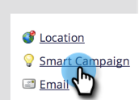

# 啟用智慧行銷活動的個人限制 {#enable-person-restrictions-for-smart-campaigns}

Marketo提供的一項功能，可限制符合Smart Campaign資格的&#x200B;_上限_&#x200B;人數。 這樣可避免不小心將整個資料庫傳送至電子郵件。

>[!NOTE]
>
>**需要管理員許可權**

>[!CAUTION]
>
>這僅適用於批次行銷活動和電子郵件方案。

1. 移至&#x200B;**[!UICONTROL Admin]**&#x200B;區域。

   

1. 按一下「**[!UICONTROL Smart Campaign]**」。

   

1. 按一下「**[!UICONTROL Edit]**」。

   

   >[!CAUTION]
   >
   >如果符合透過Smart Campaign執行資格的人數超過所設定的限制，則完全不會執行。

1. 輸入限制並按一下&#x200B;**[!UICONTROL Save]**。

   

   >[!TIP]
   >
   >將此欄位設為空白以停用此功能。

   >[!CAUTION]
   >
   >此限制會套用至所有Smart Campaigns，但可在行銷活動層級覆寫。 瞭解如何在Smart Campaign[中](/help/marketo/product-docs/core-marketo-concepts/smart-campaigns/using-smart-campaigns/override-person-restrictions-in-a-smart-campaign.md)覆寫人員限制。

完成！ 您剛剛開啟了安全開關。

>[!MORELIKETHIS]
>
>[在智慧行銷活動中覆寫人員限制](/help/marketo/product-docs/core-marketo-concepts/smart-campaigns/using-smart-campaigns/override-person-restrictions-in-a-smart-campaign.md)
