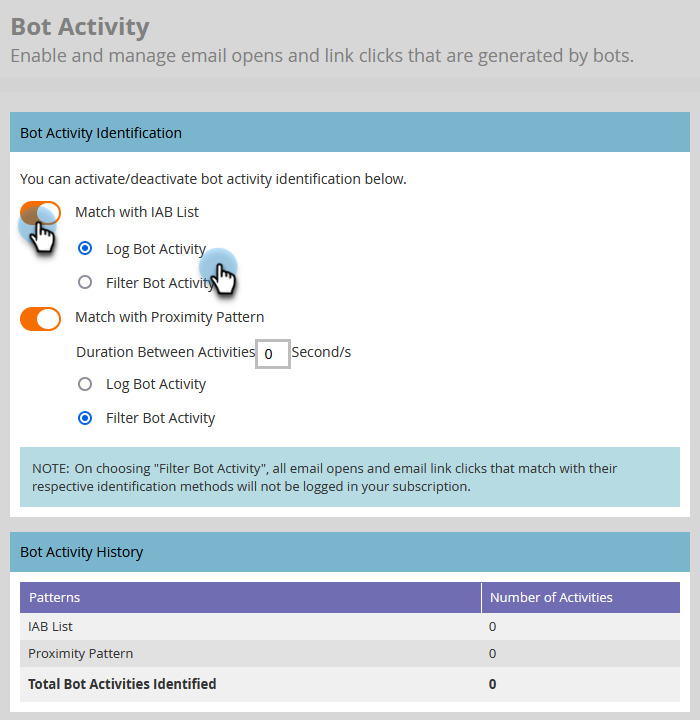

# 篩選電子郵件機器人活動TEMP DOC{#filtering-email-bot-activity}

有時候，電子郵件機器人活動可能會讓您的電子郵件開啟和點按資料不實膨脹。 請依照下列步驟修正此問題。

我們使用兩種不同的方法來確認機器人活動：

* 比對對象 [Interactive Advertising Bureau機器人清單](https://www.iab.com/guidelines/iab-abc-international-spiders-bots-list/){target="_blank"}：與IAB UA/IP （使用者代理/IP位址）清單上的任何專案相符的活動將標示為機器人。
* 符合近似程度模式：當同時發生兩個以上的活動時（在一秒以內），這些活動會被識別為機器人。 比較期間考慮的屬性包括：
   * 銷售機會ID （應相同）
   * 電子郵件資產（應相同）
   * 連結點選或電子郵件開啟
   * 時間差異（應小於1秒）

針對電子郵件連結點選和電子郵件開啟活動，新屬性將填入以下值：

* 識別為機器人的活動會將「機器人活動」設為「True」，並將「機器人活動模式」設為識別的模式/方法
* 識別為不是機器人的活動會將「機器人活動」設為「False」，並將「機器人活動模式」設為「N/A」
* 在引入這些屬性之前發生的活動會將「機器人活動」設為「 」（空白），並將「機器人活動模式」設為「 」（空白）

## 選取篩選器型別 {#select-filter-type}

1. 按一下 **[!UICONTROL 管理員]**.

   

1. 按一下 **[!UICONTROL 電子郵件]**.

   

1. 按一下 **[!UICONTROL 機器人活動]** 標籤。

   

1. 有兩個滑桿可供選擇。 您只能啟用其中一項或兩項。 如果您啟用 **[!UICONTROL 與IAB清單相符]**，選擇是否要 [!UICONTROL 記錄機器人活動] _或_ [!UICONTROL 篩選機器人活動].

   

1. 如果您啟用 **[!UICONTROL 與近似程度模式相符]**，選擇是否要 [!UICONTROL 記錄機器人活動] _或_ [!UICONTROL 篩選機器人活動]. 您也可以為以下設定秒數： **活動之間的持續時間** （預設為0，最大為3）。

   

>[!NOTE]
>
>替換為 **活動之間的持續時間** 設為0秒，我們會識別同時發生的電子郵件活動。 如果在指定的秒數內發生多個電子郵件活動，則會將其識別為機器人活動。

>[!IMPORTANT]
>
>* 如果您選擇 [!UICONTROL 篩選機器人活動]，您可能會看到電子郵件開啟次數和點按次數下降，因為false活動被淘汰了。

**選擇性步驟**：若要停用任一功能，只要取消選取個別的滑桿即可。 如果您這麼做，資料不會重設。

>[!TIP]
>
>透過「在電子郵件中點按連結」和「開啟電子郵件」篩選器中的「是機器人活動」布林值（是/否）和「機器人活動模式」，以及「在電子郵件中點按連結」和「開啟電子郵件」觸發器，利用智慧清單中的機器人活動資料。

## IP封鎖清單 {#ip-blocklist}

我們已編譯負責產生數百萬個假參與的IP位址清單，例如從下列任何IP收到的這類參與會自動篩選掉，而不會新增至您的Marketo Engage執行個體。 這可能會導致電子郵件開啟、點按及其他相關活動的減少。 以下清單可能會定期更新。

* 40.94.34.52
* 40.94.34.86
* 52.34.76.65
* 54.70.53.60
* 54.71.187.124
* 60.28.2.248
* 64.235.150.252
* 64.235.153.10
* 64.235.153.2
* 64.235.154.105
* 64.235.154.109
* 64.235.154.140
* 64.74.215.1
* 64.74.215.100
* 64.74.215.138
* 64.74.215.139
* 64.74.215.142
* 64.74.215.146
* 64.74.215.150
* 64.74.215.154
* 64.74.215.158
* 64.74.215.162
* 64.74.215.164
* 64.74.215.166
* 64.74.215.170
* 64.74.215.174
* 64.74.215.176
* 64.74.215.178
* 64.74.215.51
* 64.74.215.56
* 64.74.215.58
* 64.74.215.59
* 64.74.215.86
* 64.74.215.98
* 65.154.226.101
* 66.249.91.149
* 70.42.131.106
* 74.125.217.116
* 74.217.90.250
* 104.129.41.4
* 104.47.55.126
* 104.47.58.126
* 104.47.70.126
* 104.47.73.126
* 104.47.73.254
* 104.47.74.126
* 128.220.160.1
* 155.70.39.101
* 162.129.251.14
* 162.129.251.42
* 208.52.157.204

>[!NOTE]
>
>在將每個IP位址新增至此清單之前，我們會仔細分析並仔細檢查該IP位址，確保只封鎖最關鍵和最有害的IP。
