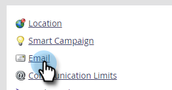

# 篩選電子郵件機器人活動 {#filtering-email-bot-activity}

有時，電子郵件機器人活動會錯誤膨脹您的電子郵件開啟和點按資料。 請依照下列步驟加以修正。

我們使用三種不同的方法來確認機器人活動：

* 符合 [Interactive Advertising Bureau機器人清單](https://www.iab.com/guidelines/iab-abc-international-spiders-bots-list/){target=&quot;_blank&quot;}:與IAB UA/IP（使用者代理/IP位址）清單上任何項目相符的活動，會標示為機器人。
* 與鄰近地區模式匹配：同時發生兩個以上活動時（在一秒以下），即會識別為機器人。 比較期間考慮的屬性包括：
   * 銷售機會ID（應相同）
   * 電子郵件資產（應相同）
   * 連結點擊或電子郵件開啟
   * 時間差（應小於一秒）

針對電子郵件連結點擊和電子郵件開啟活動，新屬性將會填入下列值：

* 已識別為機器人的活動會將「機器人活動」設為「True」，並將「機器人活動模式」設為已識別的模式/方法
* 已識別為非機器人的活動會將「機器人活動」設為「False」，並將「機器人活動模式」設為「N/A」
* 我們導入這些屬性之前發生的活動，其「機器人活動」會顯示為「 」（空白），「機器人活動模式」會顯示為「 」（空白）

1. 按一下 **管理**.

   

1. 按一下 **電子郵件**.

   

1. 按一下 **機器人活動** 標籤。

   

1. 選擇 **與IAB清單相符**, **與鄰近圖樣比對**，或兩者皆有。 選擇是否記錄機器人活動 _或_ 篩選機器人活動。

   

>[!NOTE]
>
>如果您選擇「篩選機器人活動」，可能會看到電子郵件開啟數下降，當刪除假活動時，會點按。

**可選步驟**:若要停用此功能，請取消選取滑桿。 如果停用，資料不會重設。

>[!TIP]
>
>透過「已點按電子郵件中的連結」和「開啟電子郵件」篩選器中的「是/否」布林值（是/否）和「機器人活動模式」，以及「點按電子郵件中的連結」和「開啟電子郵件」觸發器，在智慧清單中運用機器人活動資料。
