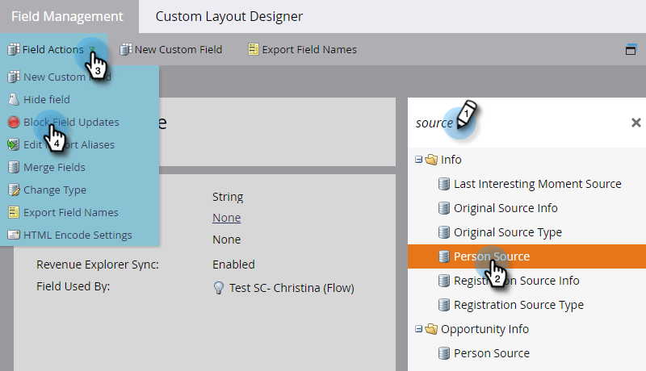

# 封鎖欄位的更新 {#block-updates-to-a-field}

封鎖欄位的更新可讓您寫入欄位一次，然後保留欄位存留期的原始值。 這對欄位（例如）很有用 [!UICONTROL 個人來源].

>[!NOTE]
>
>**需要管理員許可權**

1. 前往 **[!UICONTROL 管理員]** 區域。

   

1. 按一下 **[!UICONTROL 欄位管理]**.

   

1. 尋找欄位，選取該欄位，然後在下方 **[!UICONTROL 欄位動作]**，按一下 **[!UICONTROL 封鎖欄位更新]**.

   

   >[!NOTE]
   >
   >您可以封鎖對的更新 [計畫成員自訂欄位](/help/marketo/product-docs/core-marketo-concepts/programs/working-with-programs/program-member-custom-fields.md) 以及。

1. 選取 **[!UICONTROL 輸入來源]** 您想要封鎖並按一下 **[!UICONTROL 套用]**.

   

   >[!CAUTION]
   >
   >執行清單匯入時，僅當欄位已由Marketo根據欄位比對的名稱自動識別，匯入預覽中遭封鎖欄位的狀態才會顯示 _完全符合_ （或如果已建立別名）。 如果從「Marketo欄位」下拉式清單手動選擇欄位，封鎖的狀態將不會顯示在匯入預覽中，但仍會對該欄位實施更新封鎖。
