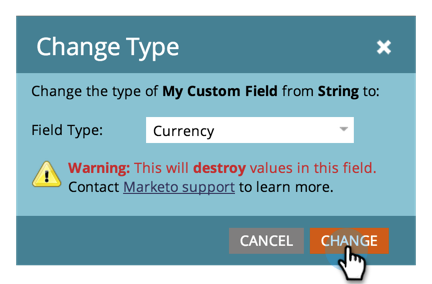

# 變更 Marketo 自訂欄位的類型 {#change-the-type-of-a-marketo-custom-field}

以下說明如何變更自訂欄位的欄位型別。

1. 前往「**[!UICONTROL Admin]**」區域。

   

1. 按一下「**[!UICONTROL Field Management]**」。

   

1. 尋找並選取所需欄位。

   

1. 在&#x200B;**[!UICONTROL Field Actions]**&#x200B;下拉式清單中，按一下&#x200B;**[!UICONTROL Change Type]**。

   

1. 選取新型別。

   >[!NOTE]
   >
   >分數和公式欄位無法變更。

   

1. 閱讀警告，然後按一下&#x200B;**[!UICONTROL Change]**&#x200B;確認。

   

   >[!NOTE]
   >
   >您看到的警告訊息會因您變更的欄位型別而異。

   >[!MORELIKETHIS]
   >
   >[在Marketo中建立自訂欄位](/help/marketo/product-docs/administration/field-management/create-a-custom-field-in-marketo.md)
